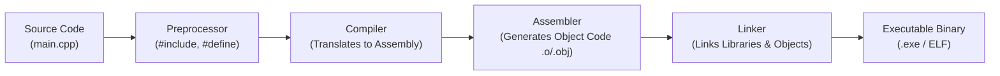

## Overview of C++

C++ is a high-performance, general-purpose, compiled programming language developed by **Bjarne Stroustrup** at Bell Labs in 1979 as an extension of the C programming language ("C with Classes").

### Key Characteristics
- **Statically Typed**: Types are checked at compile time.
- **Compiled**: Source code compiles directly to machine code via a compiler.
- **Multi-paradigm**: Supports procedural, object-oriented, and generic programming.
- **Direct Memory Management**: Supports raw pointers and low-level memory control.

---

## Compilation and Execution Pipeline



---

## Structure of a C++ Program

```cpp
#include <iostream>

using namespace std;

int main() {
    cout << "Hello, World!" << endl;
    return 0;
}
```

### Breakdown of Components

1. `#include <iostream>`:
   - Preprocessor directive that includes the Input/Output Stream library for console operations.
2. `using namespace std;`:
   - Allows identifiers from the standard namespace (`std`) to be used without prefixing `std::`.
3. `int main()`:
   - The entry point where program execution begins. Returns an integer exit code to the operating system.
4. `cout << "Hello, World!" << endl;`:
   - `cout` (character output stream) writes data to standard output.
   - `<<` is the stream insertion operator.
   - `endl` inserts a newline character and flushes the output stream buffer.
5. `return 0;`:
   - Indicates successful program termination to the host operating system.

---

## Basic Input and Output (I/O Streams)

| Stream Object | Purpose | Operator | Example |
| :--- | :--- | :--- | :--- |
| `cin` | Standard Input (Keyboard) | `>>` (Extraction) | `cin >> age;` |
| `cout` | Standard Output (Screen) | `<<` (Insertion) | `cout << "Age: " << age;` |
| `cerr` | Standard Error (Unbuffered) | `<<` (Insertion) | `cerr << "Error occurred";` |
| `clog` | Standard Log (Buffered) | `<<` (Insertion) | `clog << "Log trace";` |

### I/O Example

```cpp
#include <iostream>

int main() {
    int studentId;
    double grade;

    std::cout << "Enter Student ID and Grade: ";
    std::cin >> studentId >> grade;

    std::cout << "Student ID: " << studentId << "\n";
    std::cout << "Grade: " << grade << std::endl;

    return 0;
}
```
