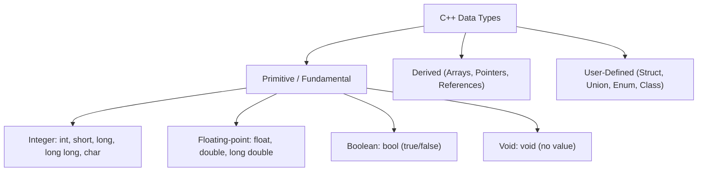

## Identifiers and Naming Rules

An **identifier** is a user-defined name given to a variable, function, array, class, or other program element.

### C++ Identifier Rules
1. Can contain letters (`a-z`, `A-Z`), digits (`0-9`), and underscores (`_`).
2. Must begin with a letter or an underscore (cannot start with a digit).
3. Case-sensitive (`total`, `Total`, and `TOTAL` are distinct identifiers).
4. Cannot use C++ reserved keywords (e.g., `int`, `return`, `class`, `const`).

---

## Fundamental Data Types



### Primitive Type Summary

| Type | Typical Size (bytes) | Value Range | Format / Example |
| :--- | :--- | :--- | :--- |
| `bool` | 1 | `true` (1) or `false` (0) | `bool isValid = true;` |
| `char` | 1 | $-128$ to $127$ (ASCII characters) | `char grade = 'A';` |
| `int` | 4 | $-2,147,483,648$ to $2,147,483,647$ | `int count = 100;` |
| `float` | 4 | $\approx \pm 3.4 \times 10^{\pm 38}$ (6-7 decimal digits) | `float price = 19.99f;` |
| `double` | 8 | $\approx \pm 1.7 \times 10^{\pm 308}$ (15-17 decimal digits) | `double pi = 3.1415926535;` |

---

## Constants

Constants are immutable values that cannot be modified after initialization.

### `const` Keyword
```cpp
const double PI = 3.141592653589793;
const int MAX_USERS = 100;
```

### Preprocessor `#define`
```cpp
#define BUFFER_SIZE 512
```

---

## C++ Operators

### 1. Arithmetic Operators

| Operator | Meaning | Example ($a=10, b=3$) | Result |
| :--- | :--- | :--- | :--- |
| `+` | Addition | `a + b` | `13` |
| `-` | Subtraction | `a - b` | `7` |
| `*` | Multiplication | `a * b` | `30` |
| `/` | Division (Integer truncation if both integer) | `a / b` | `3` |
| `%` | Modulo (Remainder of division) | `a % b` | `1` |

### 2. Increment and Decrement Operators

```cpp
int x = 5;
int y = ++x; // Prefix: x becomes 6, then y is assigned 6
int z = x++; // Postfix: z is assigned 6, then x becomes 7
```

### 3. Relational / Comparison Operators

| Operator | Meaning | Example ($x=5, y=10$) | Result |
| :--- | :--- | :--- | :--- |
| `==` | Equal to | `x == y` | `false` |
| `!=` | Not equal to | `x != y` | `true` |
| `>` | Greater than | `x > y` | `false` |
| `<` | Less than | `x < y` | `true` |
| `>=` | Greater than or equal to | `x >= 5` | `true` |
| `<=` | Less than or equal to | `y <= 10` | `true` |

### 4. Logical Operators

| Operator | Name | Behavior |
| :--- | :--- | :--- |
| `&&` | Logical AND | Returns `true` only if both operands are `true` (Short-circuit evaluation) |
| `\|\|` | Logical OR | Returns `true` if at least one operand is `true` |
| `!` | Logical NOT | Inverts the boolean truth value |

### 5. Compound Assignment Operators

| Operator | Equivalent Expression |
| :--- | :--- |
| `x += 5` | `x = x + 5` |
| `x -= 2` | `x = x - 2` |
| `x *= 3` | `x = x * 3` |
| `x /= 4` | `x = x / 4` |
| `x %= 2` | `x = x % 2` |
