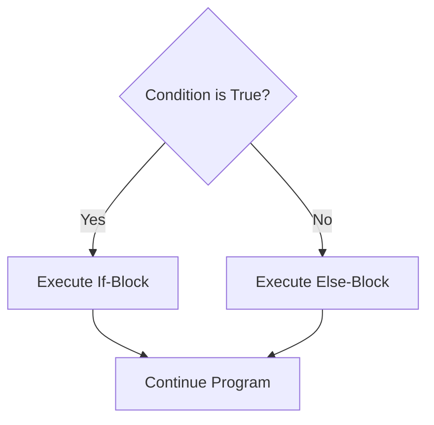
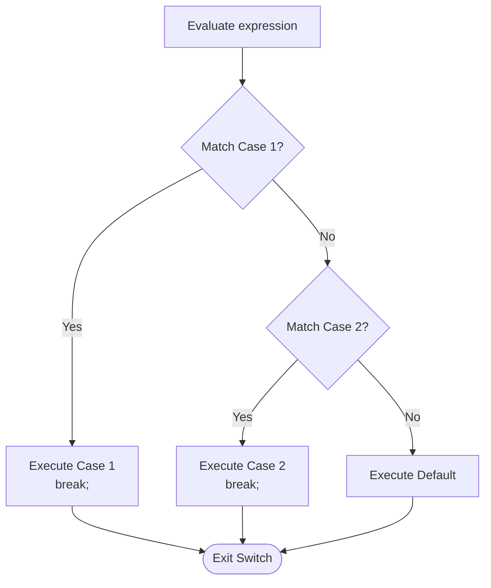

## Selection Statements Overview

Selection control structures alter the sequential flow of program execution based on the evaluation of boolean conditions.



---

## 1. `if` Statement

Executes a block of code only if the condition evaluates to `true`.

```cpp
if (condition) {
    // Statements executed if condition is true
}
```

---

## 2. `if-else` Statement

Provides alternative paths for `true` and `false` outcomes.

```cpp
if (score >= 75) {
    cout << "Status: Passed\n";
} else {
    cout << "Status: Failed\n";
}
```

---

## 3. `if-else if-else` Ladder

Used for evaluating multiple mutually exclusive conditions in sequential order.

```cpp
if (marks >= 90) {
    grade = 'A';
} else if (marks >= 80) {
    grade = 'B';
} else if (marks >= 70) {
    grade = 'C';
} else if (marks >= 60) {
    grade = 'D';
} else {
    grade = 'F';
}
```

---

## 4. `switch-case` Statement

The `switch` statement selects one of many code blocks to be executed based on an integral or enumeration expression.



### Syntax and Example

```cpp
#include <iostream>
using namespace std;

int main() {
    char op;
    double a, b;

    cout << "Enter operator (+, -, *, /): ";
    cin >> op;
    cout << "Enter two operands: ";
    cin >> a >> b;

    switch (op) {
        case '+':
            cout << "Result: " << (a + b) << endl;
            break;
        case '-':
            cout << "Result: " << (a - b) << endl;
            break;
        case '*':
            cout << "Result: " << (a * b) << endl;
            break;
        case '/':
            if (b != 0) {
                cout << "Result: " << (a / b) << endl;
            } else {
                cout << "Error: Division by zero" << endl;
            }
            break;
        default:
            cout << "Error: Invalid operator" << endl;
            break;
    }

    return 0;
}
```

---

## 5. Ternary Conditional Operator (`?:`)

A shorthand conditional expression that returns one of two values:

$$
\Large
\text{condition } ? \text{ expression\_if\_true } : \text{ expression\_if\_false}
$$

```cpp
int maxVal = (a > b) ? a : b;
```
