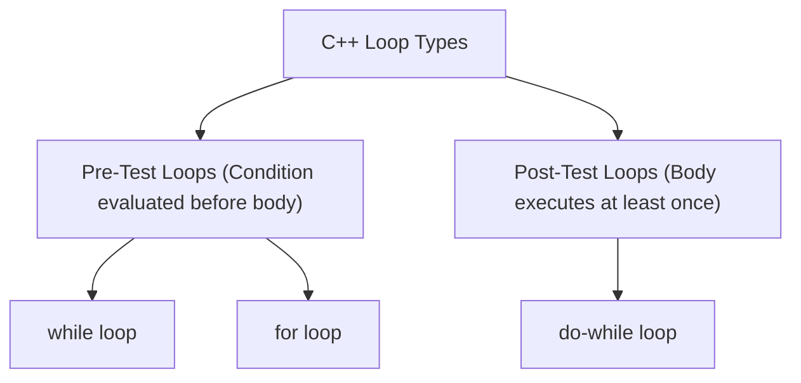
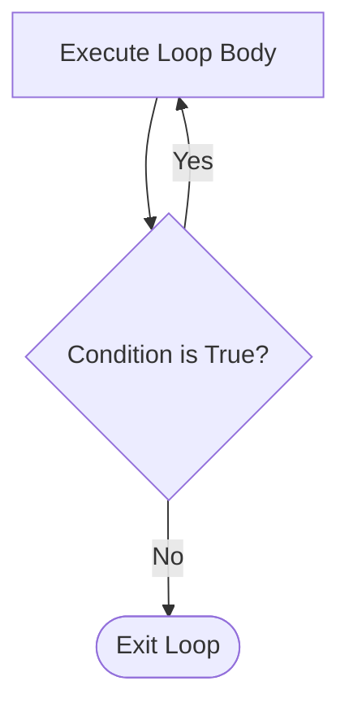

## Loops Overview

Iterative control structures repeatedly execute a block of code while a specified condition evaluates to `true`.



---

## 1. `while` Loop

A pre-test loop that evaluates the condition before executing the loop body.

```cpp
while (condition) {
    // Loop body
    // Update expression
}
```

$$
\textit{eg. Printing numbers 1 to 5:}\\
$$

```cpp
int i = 1;
while (i <= 5) {
    cout << i << " ";
    i++;
}
```

---

## 2. `do-while` Loop

A post-test loop where the body is executed at least once before the condition is checked.



```cpp
int choice;
do {
    cout << "\nMenu Options:\n1. Play Game\n2. Instructions\n3. Exit\n";
    cout << "Enter choice: ";
    cin >> choice;
} while (choice != 3);
```

---

## 3. `for` Loop

A compact loop ideal for counter-controlled iterations.

$$
\Large
\text{for } (\text{initialization}; \; \text{condition}; \; \text{iteration}) \{ \dots \}
$$

```cpp
for (int i = 1; i <= 5; i++) {
    cout << "Count: " << i << endl;
}
```

---

## 4. Jump Statements in Loops

| Statement | Behavior |
| :--- | :--- |
| `break` | Immediately terminates the enclosing loop and transfers control to the statement following the loop. |
| `continue` | Skips the remainder of the current iteration and evaluates the next loop condition/step. |

```cpp
for (int i = 1; i <= 10; i++) {
    if (i == 3) continue; // Skips printing 3
    if (i == 7) break;    // Terminates loop when i reaches 7
    cout << i << " ";
}
// Output: 1 2 4 5 6
```

---

## 5. Nested Loops

A loop placed inside another loop (e.g., used for 2D grids and matrix operations).

```cpp
for (int row = 1; row <= 3; row++) {
    for (int col = 1; col <= 3; col++) {
        cout << "(" << row << "," << col << ") ";
    }
    cout << "\n";
}
```
