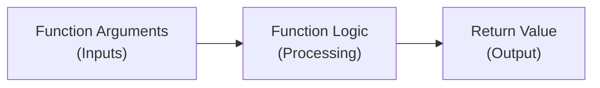
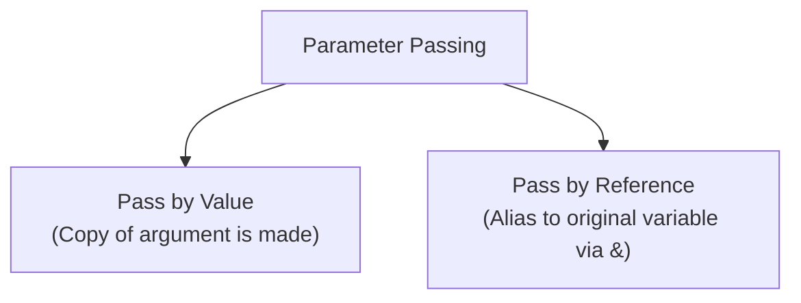

## Functions Overview

A **function** is a self-contained module of code that performs a specific subtask, promoting code reuse, readability, and modular software design.



---

## Anatomy of a Function

$$
\Large
\text{return\_type } \text{function\_name}(\text{parameter\_list}) \{ \dots \}
$$

Where:
- **Return Type**: The data type of the value the function returns to the caller (`int`, `double`, `void`, etc.).
- **Function Name**: The identifier used to call the function.
- **Parameters**: Variables that receive values passed into the function.
- **Body**: The block of statements executing the algorithm.

```cpp
#include <iostream>

// Function Declaration (Prototype)
int add(int a, int b);

int main() {
    int sum = add(15, 25); // Function Call
    std::cout << "Sum: " << sum << std::endl;
    return 0;
}

// Function Definition
int add(int a, int b) {
    return a + b;
}
```

---

## Parameter Passing Mechanisms



### 1. Pass by Value
Modifications inside the function do not affect the original caller's variable.

```cpp
void modifyValue(int x) {
    x = 100; // Original variable remains unchanged
}
```

### 2. Pass by Reference
Modifications inside the function directly change the caller's variable.

```cpp
void swapNumbers(int &a, int &b) {
    int temp = a;
    a = b;
    b = temp;
}
```

---

## Function Overloading

C++ allows multiple functions to share the same name provided they have different parameter lists (different number or types of parameters).

```cpp
int multiply(int a, int b) {
    return a * b;
}

double multiply(double a, double b) {
    return a * b;
}

int multiply(int a, int b, int c) {
    return a * b * c;
}
```

---

## Recursion

A recursive function is a function that calls itself directly or indirectly to solve smaller instances of the same problem.

### Key Requirements
1. **Base Case**: The termination condition where the function stops calling itself.
2. **Recursive Step**: The function calling itself with reduced input.

$$
\textit{eg. Factorial Function:}\\
\Large
n! = \begin{cases}
1 & \text{if } n = 0 \lor n = 1\\
n \cdot (n - 1)! & \text{if } n > 1
\end{cases}
$$

```cpp
int factorial(int n) {
    if (n <= 1) return 1; // Base case
    return n * factorial(n - 1); // Recursive call
}
```
