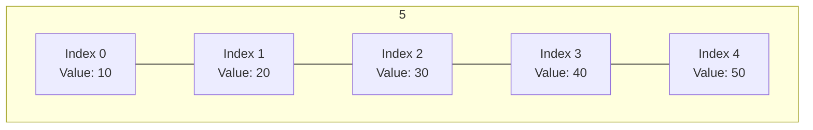
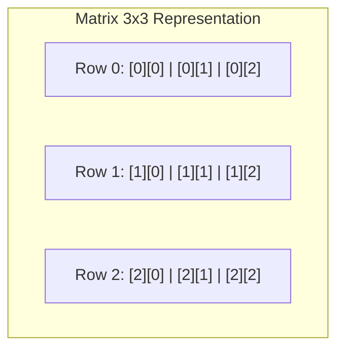

## Arrays Overview

An **array** is a fixed-size, contiguous collection of elements of the same data type stored sequentially in memory.



---

## 1. Single-Dimensional Arrays

### Declaration and Initialization

$$
\Large
\text{data\_type } \text{array\_name}[\text{array\_size}];
$$

```cpp
int scores[5] = {85, 92, 78, 90, 88};
int numbers[] = {1, 2, 3, 4}; // Size automatically deduced as 4
```

### Accessing Array Elements
Array indexing in C++ is zero-based ($0$ to $\text{size} - 1$).

```cpp
scores[0] = 95; // Modify first element
int lastScore = scores[4]; // Access 5th element
```

### Array Traversal

```cpp
#include <iostream>

int main() {
    int data[5] = {10, 20, 30, 40, 50};
    int total = 0;

    for (int i = 0; i < 5; i++) {
        total += data[i];
    }

    std::cout << "Sum = " << total << std::endl;
    return 0;
}
```

---

## 2. Multidimensional Arrays (2D Arrays / Matrices)

A 2D array is an array of arrays, logically structured as rows and columns.

$$
\Large
\text{data\_type } \text{matrix}[\text{rows}][\text{columns}];
$$



### Initialization and Matrix Traversal

```cpp
#include <iostream>

int main() {
    int matrix[2][3] = {
        {1, 2, 3},
        {4, 5, 6}
    };

    for (int row = 0; row < 2; row++) {
        for (int col = 0; col < 3; col++) {
            std::cout << matrix[row][col] << "\t";
        }
        std::cout << "\n";
    }

    return 0;
}
```

---

## Passing Arrays to Functions

Arrays are passed to functions by reference (decaying to a pointer to the first element).

```cpp
void printArray(const int arr[], int size) {
    for (int i = 0; i < size; i++) {
        std::cout << arr[i] << " ";
    }
    std::cout << "\n";
}
```
