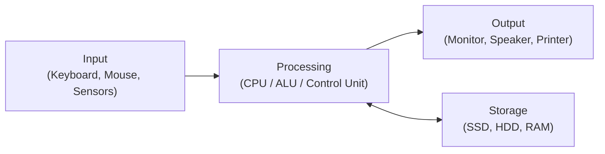
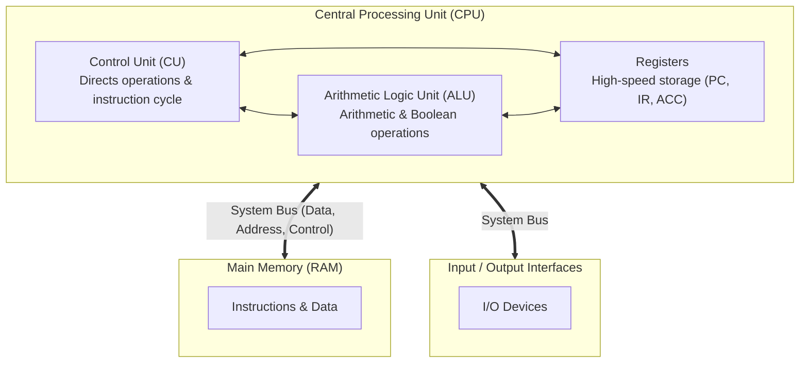
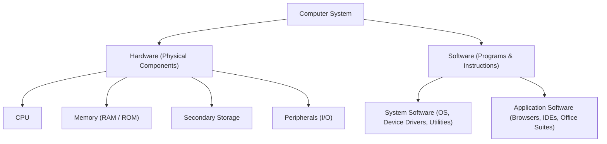

## Computer System Definition

A **computer** is an electronic device that manipulates information or data according to stored instructions. It operates under the Information Processing Cycle:

---

## Generations of Computers

| Generation | Era | Primary Switching Technology | Key Innovations |
| :--- | :--- | :--- | :--- |
| **1st Gen** | 1940 – 1956 | Vacuum Tubes | Magnetic drums, Machine language (ENIAC, UNIVAC) |
| **2nd Gen** | 1956 – 1963 | Transistors | Assembly language, FORTRAN, COBOL |
| **3rd Gen** | 1964 – 1971 | Integrated Circuits (ICs) | Operating systems, Keyboards, Monitors |
| **4th Gen** | 1971 – Present | Very Large Scale Integration (VLSI / Microprocessors) | Personal Computers, Internet, Mobile devices |
| **5th Gen** | Present – Future | Ultra Large Scale Integration (ULSI) & AI | Quantum computing, Neural networks, Parallel processing |

---

## Von Neumann Architecture

The foundation of modern computer architectures, characterized by the stored-program concept where data and instructions share the same memory space.

---

## Computer Hardware vs. Software

---

## Data Units and Representation

Computers use the **binary numbering system** (bits $0$ and $1$) to represent data at the physical level:

$$
\Large
1 \text{ Byte} = 8 \text{ Bits}
$$

| Unit | Symbol | Exact Power of 2 (Bytes) | Decimal Approximation |
| :--- | :--- | :--- | :--- |
| **Kilobyte** | KB | $2^{10} = 1,024 \text{ B}$ | $10^3 \text{ B}$ |
| **Megabyte** | MB | $2^{20} = 1,048,576 \text{ B}$ | $10^6 \text{ B}$ |
| **Gigabyte** | GB | $2^{30} = 1,073,741,824 \text{ B}$ | $10^9 \text{ B}$ |
| **Terabyte** | TB | $2^{40} = 1,099,511,627,776 \text{ B}$ | $10^{12} \text{ B}$ |
| **Petabyte** | PB | $2^{50} \text{ B}$ | $10^{15} \text{ B}$ |
