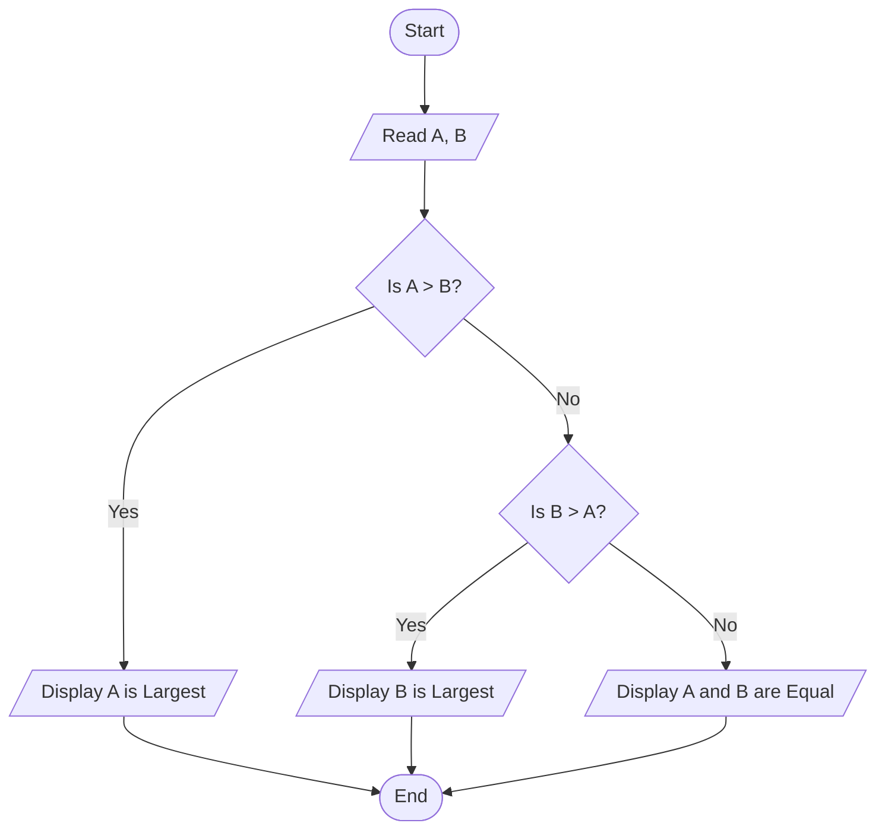
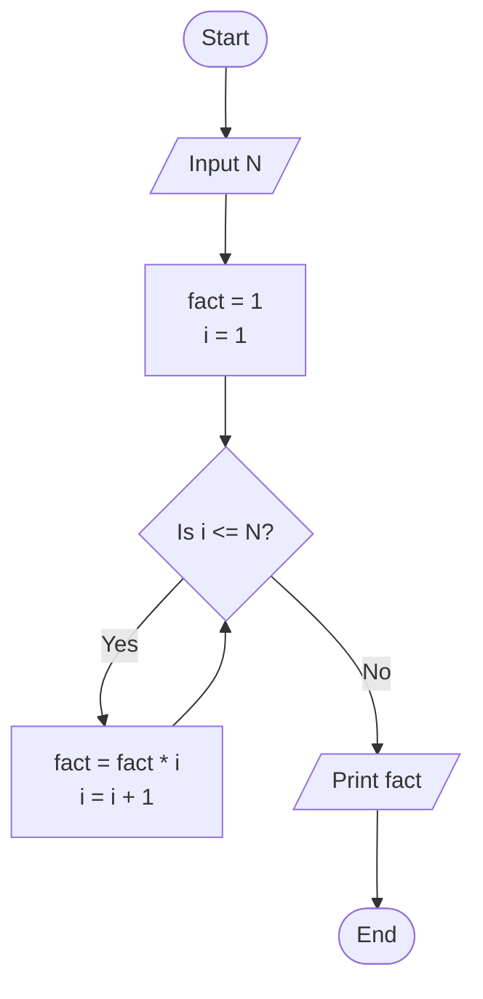

## Algorithm Definition and Properties

An **algorithm** is a finite, step-by-step sequence of unambiguous instructions designed to solve a specific computational problem.

### Essential Characteristics
1. **Finiteness**: Must terminate after a finite number of steps.
2. **Definiteness**: Each step must be precisely and unambiguously defined.
3. **Input**: Accepts zero or more inputs.
4. **Output**: Produces at least one output.
5. **Effectiveness**: Operations must be feasible and basic enough to execute.

---

## Flowcharting Standards

A **flowchart** is a diagrammatic representation of an algorithm using standardized geometric symbols connected by flowlines.

### Standard Flowchart Symbols

| Symbol Name | Geometric Shape | Function |
| :--- | :--- | :--- |
| **Terminator** | Oval / Rounded Rectangle | Denotes the Start or End of a program/subroutine. |
| **Process** | Rectangle | Represents computational operations, calculations, or variable assignments. |
| **Input / Output** | Parallelogram | Represents input operations (reading data) or output operations (displaying results). |
| **Decision** | Diamond | Represents conditional branches (evaluates True/False or Yes/No). |
| **Connector** | Small Circle | Connects flowlines across different sections of the same page. |
| **Flowline** | Directed Arrow ($\to$) | Indicates the sequence and direction of control flow. |

---

## Flowchart Representation: Finding the Largest of Two Numbers



---

## Pseudocode vs. Flowcharts

**Pseudocode** is an informal, high-level description of an algorithm intended for human reading rather than machine execution.

### Example Comparison: Factorial of $N$

#### Pseudocode
```text
BEGIN
    PROMPT "Enter a positive integer N: "
    READ N
    SET fact = 1
    SET i = 1
    
    WHILE i <= N DO
        fact = fact * i
        i = i + 1
    ENDWHILE
    
    PRINT "Factorial: ", fact
END
```

#### Flowchart

