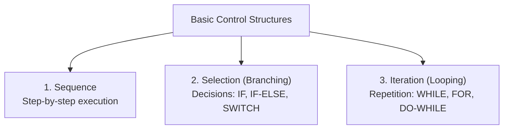
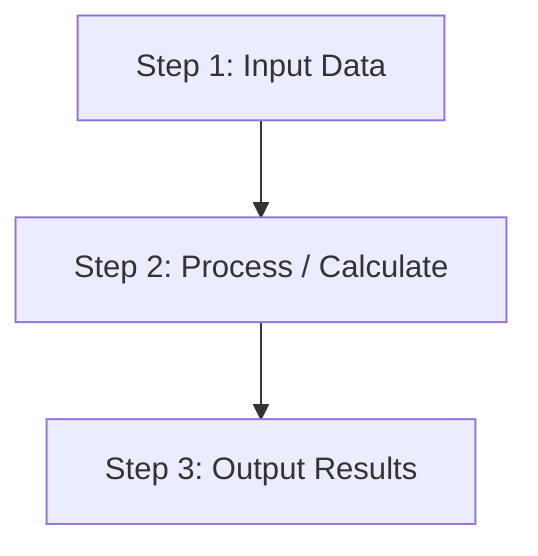
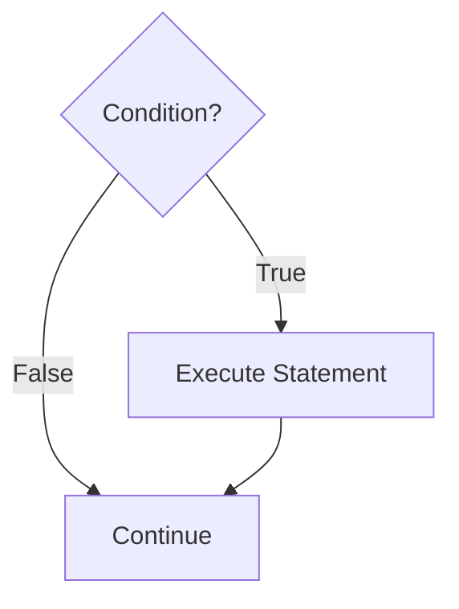
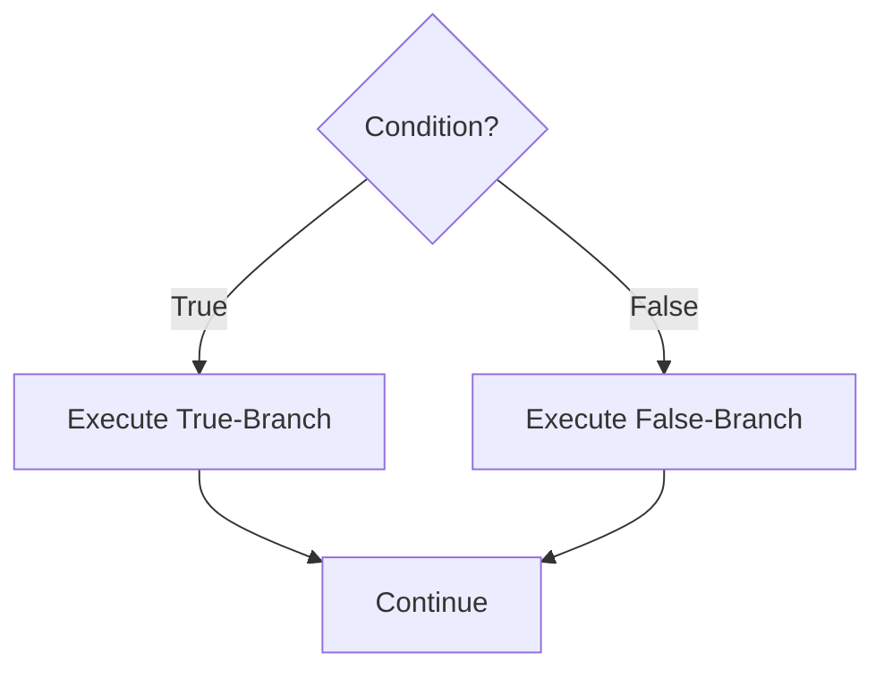
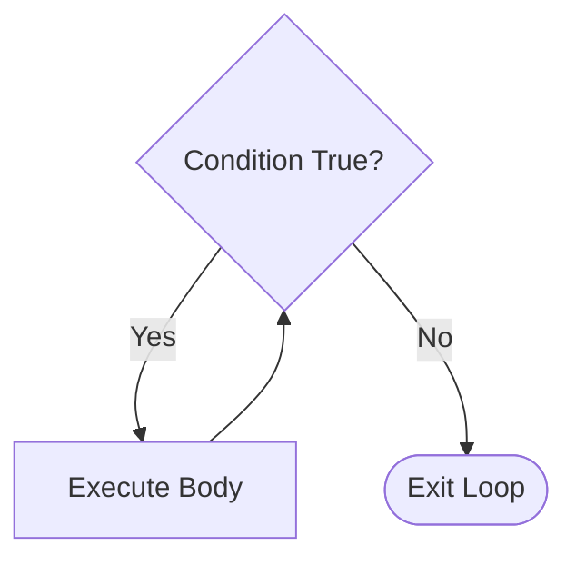
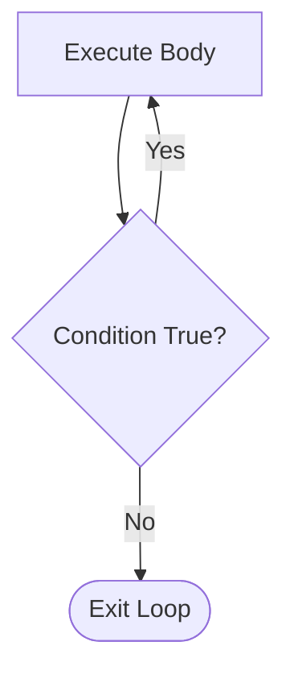

## Fundamental Control Structures

The **Böhm-Jacopini Theorem** states that any computable algorithm can be expressed using only three basic control structures:

---

## 1. Sequence Structure

Actions are executed in exact sequential order from top to bottom without branching.

---

## 2. Selection Structures

Directs program execution to different branches based on condition evaluation.

### Single-Alternative (`if`)

### Dual-Alternative (`if-else`)

### Multi-Alternative (`switch` / `if-elif-else`)
Evaluates an expression against multiple values or multiple cascaded conditions.

---

## 3. Iteration Structures

Repeats execution of statements while a condition remains true.

### Pre-test Loop (`while` / `for`)
Condition evaluated **before** executing the loop body. Body executes $0$ or more times.

### Post-test Loop (`do-while`)
Condition evaluated **after** executing the loop body. Body executes **at least once**.

---

## Summary of Loop Types

| Loop Construct | Evaluation Point | Minimum Iterations | Typical Use Case |
| :--- | :--- | :--- | :--- |
| **`for`** | Pre-test | $0$ | Known number of iterations (counter-driven) |
| **`while`** | Pre-test | $0$ | Unknown number of iterations (event/sentinel-driven) |
| **`do-while`** | Post-test | $1$ | Menu selections, user input validation |
