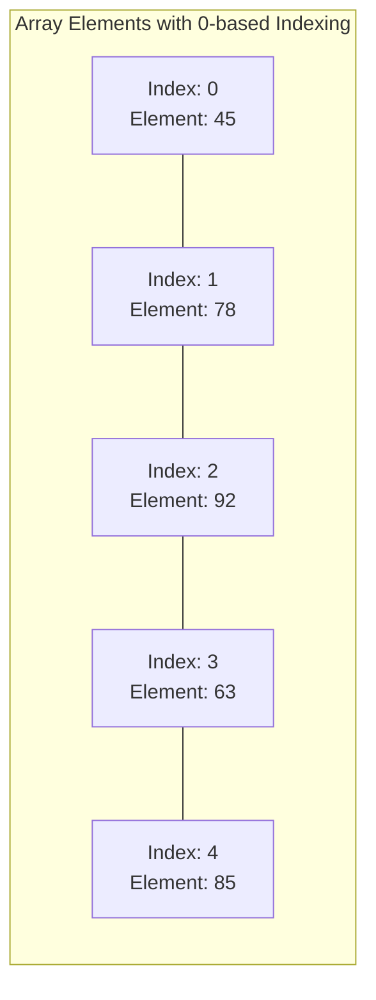
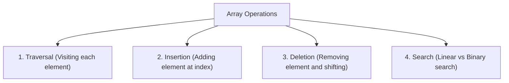
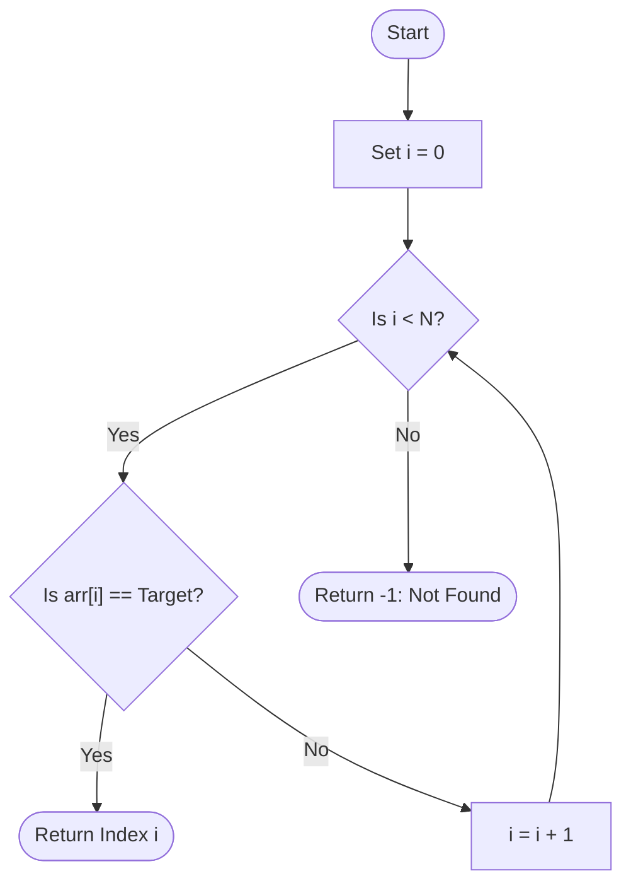
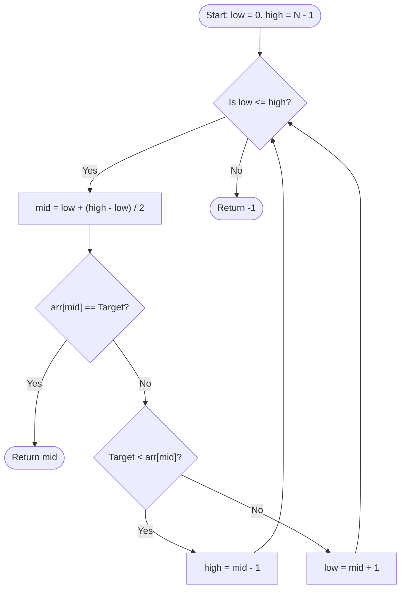

## Array Concept and Memory Organization

An **array** is a linear data structure that stores a fixed-size, sequential collection of elements of the same type in contiguous memory locations.

### Direct Index Addressing Formula
Given base address $\text{Addr}(0)$ and element size $S$ in bytes, the address of element $i$ is:

$$
\Large
\text{Addr}(i) = \text{Addr}(0) + (i \times S)
$$

Where:
- $\large \text{Addr}(0)$ is the **Base Address** of the array
- $\large i$ is the **Index position** ($0 \le i < N$)
- $\large S$ is the **Size of each element** in bytes

---

## Basic Array Operations

---

## Searching Algorithms

### 1. Linear Search (Sequential Search)
Scans elements one by one from start to end.
- **Precondition**: None (works on unsorted data).
- **Time Complexity**: $O(N)$ worst/average case, $O(1)$ best case.

---

### 2. Binary Search
Efficient search on **sorted arrays** that repeatedly divides the search interval in half.
- **Precondition**: Array must be sorted.
- **Time Complexity**: $O(\log N)$ worst/average case, $O(1)$ best case.

