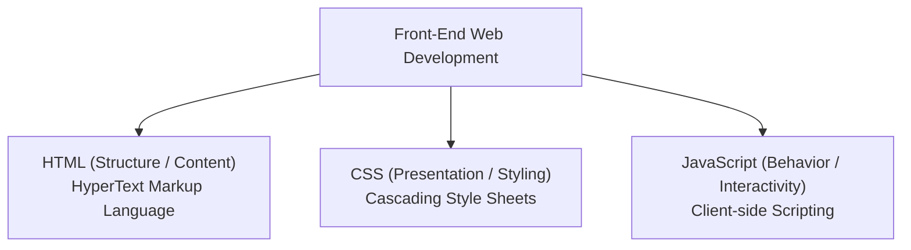
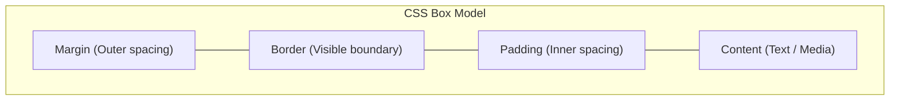
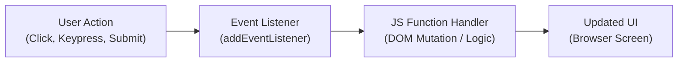

## The Three Layers of Front-End Web Development

Front-end web architecture is structured into three distinct layers:



---

## 1. HTML5 (HyperText Markup Language)

Defines the structure and semantic meaning of web content using tags and elements.

### Basic Document Structure

```html
<!DOCTYPE html>
<html lang="en">
<head>
    <meta charset="UTF-8">
    <meta name="viewport" content="width=device-width, initial-scale=1.0">
    <title>Sample Page</title>
</head>
<body>
    <header>
        <h1>Main Heading</h1>
    </header>
    <main>
        <p>This is a paragraph with a <a href="https://example.com">link</a>.</p>
    </main>
</body>
</html>
```

---

## 2. CSS3 (Cascading Style Sheets)

Controls the layout, typography, colors, and visual presentation.

### The CSS Box Model



### Syntax and Styling Example

```css
body {
    font-family: Arial, sans-serif;
    background-color: #f4f4f4;
    color: #333;
    margin: 0;
    padding: 20px;
}

.card {
    background: #ffffff;
    border: 1px solid #ddd;
    border-radius: 8px;
    padding: 16px;
    box-shadow: 0 2px 4px rgba(0,0,0,0.1);
}
```

---

## 3. JavaScript (Client-Side Interactivity)

A dynamic programming language that enables interactive elements, DOM (Document Object Model) manipulation, and event handling in web browsers.



### Interactive DOM Example

```html
<button id="counterBtn">Clicks: 0</button>

<script>
    let count = 0;
    const button = document.getElementById("counterBtn");

    button.addEventListener("click", () => {
        count++;
        button.textContent = `Clicks: ${count}`;
    });
</script>
```
