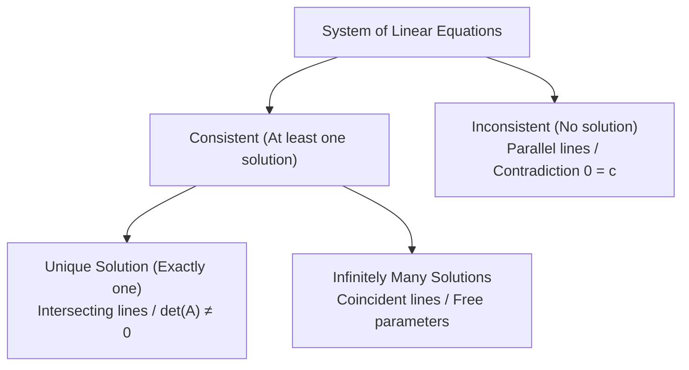

## Linear Equations

A **linear equation** in $n$ variables $x_1, x_2, \dots, x_n$ is an algebraic equation of the form:

$$
\Huge
a_1 x_1 + a_2 x_2 + \dots + a_n x_n = b
$$

Where:
- $\large a_1, a_2, \dots, a_n \in \mathbb{R}$ are the **Coefficients**
- $\large x_1, x_2, \dots, x_n$ are the **Variables / Unknowns**
- $\large b \in \mathbb{R}$ is the **Constant term**

---

## Systems of Linear Equations (SLE)

A system of $m$ linear equations in $n$ variables is written as:

$$
\Large
\begin{cases}
a_{11}x_1 + a_{12}x_2 + \dots + a_{1n}x_n = b_1\\
a_{21}x_1 + a_{22}x_2 + \dots + a_{2n}x_n = b_2\\
\quad \vdots\\
a_{m1}x_1 + a_{m2}x_2 + \dots + a_{mn}x_n = b_m
\end{cases}
$$

Matrix form:
$$
\Huge
A\mathbf{x} = \mathbf{b}
$$

Where:
- $\large A \in \mathbb{R}^{m \times n}$ is the **Coefficient Matrix**
- $\large \mathbf{x} \in \mathbb{R}^{n \times 1}$ is the **Variable Vector**
- $\large \mathbf{b} \in \mathbb{R}^{m \times 1}$ is the **Constant Vector**

---

## Classification of Solutions

---

## Parametric Representation of Solutions

When a consistent system has free variables, solutions are expressed parametrically using parameters $s, t \in \mathbb{R}$.

$$
\textit{eg. Given equation: } x_1 + 2x_2 = 4\\
\large
\begin{align*}
\text{Let } x_2 &= t \quad (\text{Free parameter}, \; t \in \mathbb{R})\\
\implies x_1 &= 4 - 2t\\[6pt]
\begin{bmatrix} x_1 \\ x_2 \end{bmatrix} &= \begin{bmatrix} 4 - 2t \\ t \end{bmatrix} = \begin{bmatrix} 4 \\ 0 \end{bmatrix} + t \begin{bmatrix} -2 \\ 1 \end{bmatrix}
\end{align*}
$$
