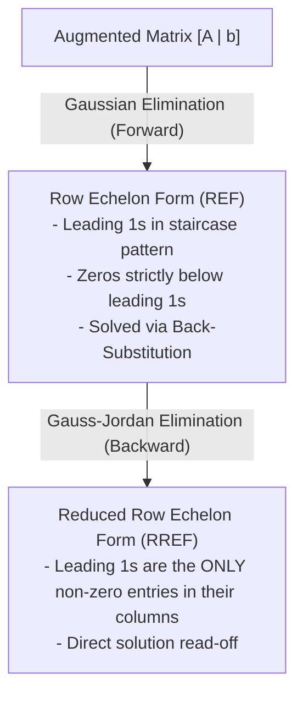

## Elementary Row Operations (EROs)

Elementary row operations transform an augmented matrix into an equivalent simpler form without changing its solution set:

1. **Row Interchange**: Swap two rows.
   $$
   \Large R_i \leftrightarrow R_j
   $$
2. **Scalar Multiplication**: Multiply all entries in a row by a non-zero scalar $k$.
   $$
   \Large k R_i \to R_i \quad (k \ne 0)
   $$
3. **Row Addition / Replacement**: Add a multiple of one row to another row.
   $$
   \Large R_i + k R_j \to R_i
   $$

---

## Row Echelon Forms



---

## Worked Example: Gaussian Elimination

Solve the linear system:
$$
\begin{cases}
x + y + 2z = 9\\
2x + 4y - 3z = 1\\
3x + 6y - 5z = 0
\end{cases}
$$

### 1. Augmented Matrix Representation
$$
\begin{bmatrix}
1 & 1 & 2 & \bigm| & 9\\
2 & 4 & -3 & \bigm| & 1\\
3 & 6 & -5 & \bigm| & 0
\end{bmatrix}
$$

### 2. Forward Elimination to REF
$$
\begin{align*}
\xrightarrow{R_2 - 2R_1 \to R_2, \; R_3 - 3R_1 \to R_3}
&\begin{bmatrix}
1 & 1 & 2 & \bigm| & 9\\
0 & 2 & -7 & \bigm| & -17\\
0 & 3 & -11 & \bigm| & -27
\end{bmatrix}\\[8pt]
\xrightarrow{\frac{1}{2}R_2 \to R_2}
&\begin{bmatrix}
1 & 1 & 2 & \bigm| & 9\\
0 & 1 & -3.5 & \bigm| & -8.5\\
0 & 3 & -11 & \bigm| & -27
\end{bmatrix}\\[8pt]
\xrightarrow{R_3 - 3R_2 \to R_3}
&\begin{bmatrix}
1 & 1 & 2 & \bigm| & 9\\
0 & 1 & -3.5 & \bigm| & -8.5\\
0 & 0 & -0.5 & \bigm| & -1.5
\end{bmatrix}\\[8pt]
\xrightarrow{-2R_3 \to R_3}
&\begin{bmatrix}
1 & 1 & 2 & \bigm| & 9\\
0 & 1 & -3.5 & \bigm| & -8.5\\
0 & 0 & 1 & \bigm| & 3
\end{bmatrix} \quad \text{(REF)}
\end{align*}
$$

### 3. Back-Substitution
$$
\begin{align*}
z &= 3\\
y - 3.5(3) = -8.5 &\implies y - 10.5 = -8.5 \implies y = 2\\
x + 2 + 2(3) = 9 &\implies x + 8 = 9 \implies x = 1\\[6pt]
\implies \mathbf{x} &= \begin{bmatrix} 1 \\ 2 \\ 3 \end{bmatrix}
\end{align*}
$$

---

## MATLAB Implementation

```matlab
% Coefficient matrix and RHS vector
A = [1 1 2; 2 4 -3; 3 6 -5];
b = [9; 1; 0];

% Augmented matrix
Aug = [A b];

% Reduced Row Echelon Form
R = rref(Aug);

% Direct linear solve
x = A \ b;
disp('Solution x:');
disp(x);
```
