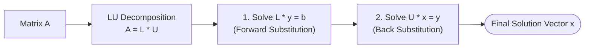

## Matrix Invertibility

A square $n \times n$ matrix $A$ is **invertible** (or non-singular) if there exists an $n \times n$ matrix $A^{-1}$ such that:

$$
\Huge
A A^{-1} = A^{-1} A = I_n
$$

Where:
- $\large I_n$ is the $n \times n$ **Identity Matrix**
- $\large A^{-1}$ is the **Multiplicative Inverse** of $A$

### Properties of Inverses
1. $(A^{-1})^{-1} = A$
2. $(AB)^{-1} = B^{-1} A^{-1}$ (Shoes-and-Socks Property)
3. $(A^T)^{-1} = (A^{-1})^T$
4. $(kA)^{-1} = \frac{1}{k} A^{-1} \quad (k \ne 0)$
5. $\det(A^{-1}) = \frac{1}{\det(A)} \quad (\det(A) \ne 0)$

---

## Inverse of a $2 \times 2$ Matrix

For a $2 \times 2$ matrix $A = \begin{bmatrix} a & b \\ c & d \end{bmatrix}$:

$$
\Large
A^{-1} = \frac{1}{ad - bc} \begin{bmatrix} d & -b \\ -c & a \end{bmatrix}
$$

Matrix $A$ is invertible if and only if $\det(A) = ad - bc \ne 0$.

---

## LU Factorization

**LU Factorization** decomposes a square matrix $A$ into the product of a **Lower Triangular Matrix** $L$ and an **Upper Triangular Matrix** $U$:

$$
\Huge
A = L \cdot U
$$

Where:
- $\large L$ is a lower triangular matrix with $1$s on the diagonal (Unit Lower Triangular).
- $\large U$ is an upper triangular matrix (the Row Echelon Form of $A$).



---

## Solving $A\mathbf{x} = \mathbf{b}$ via LU Decomposition

Given $A\mathbf{x} = \mathbf{b}$ and $A = LU$:

1. Substitute $A = LU$:
   $$
   L(U\mathbf{x}) = \mathbf{b}
   $$
2. Let $\mathbf{y} = U\mathbf{x}$. Solve for $\mathbf{y}$ via **Forward Substitution**:
   $$
   L\mathbf{y} = \mathbf{b}
   $$
3. Solve for $\mathbf{x}$ via **Back-Substitution**:
   $$
   U\mathbf{x} = \mathbf{y}
   $$

---

## MATLAB Implementation

```matlab
% Matrix definition
A = [2, 1, 1; 4, 3, 3; 8, 7, 9];
b = [4; 10; 24];

% LU Decomposition
[L, U] = lu(A);

% Solve Ly = b, then Ux = y
y = L \ b;
x = U \ y;

disp('L matrix:'); disp(L);
disp('U matrix:'); disp(U);
disp('Solution x:'); disp(x);
```
