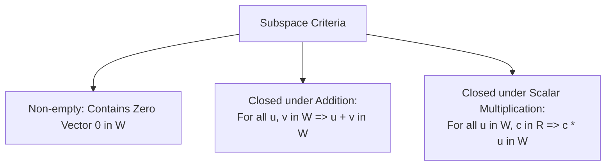

## Definition of a Vector Space

A **vector space** $V$ over a field of scalars $F$ (typically $\mathbb{R}$) is a set of objects (vectors) equipped with two operations: **vector addition** ($+$) and **scalar multiplication** ($\cdot$), satisfying the 10 Vector Space Axioms:

### Closure Axioms
1. **Closure under Addition**: $\forall \mathbf{u}, \mathbf{v} \in V, \; \mathbf{u} + \mathbf{v} \in V$
2. **Closure under Scalar Multiplication**: $\forall \mathbf{u} \in V, \; c \in \mathbb{R}, \; c\mathbf{u} \in V$

### Addition Axioms
3. **Commutativity**: $\mathbf{u} + \mathbf{v} = \mathbf{v} + \mathbf{u}$
4. **Associativity**: $(\mathbf{u} + \mathbf{v}) + \mathbf{w} = \mathbf{u} + (\mathbf{v} + \mathbf{w})$
5. **Additive Identity**: $\exists \mathbf{0} \in V \text{ such that } \mathbf{u} + \mathbf{0} = \mathbf{u}$
6. **Additive Inverse**: $\forall \mathbf{u} \in V, \; \exists (-\mathbf{u}) \in V \text{ such that } \mathbf{u} + (-\mathbf{u}) = \mathbf{0}$

### Scalar Multiplication Axioms
7. **Scalar Distributivity over Vector Addition**: $c(\mathbf{u} + \mathbf{v}) = c\mathbf{u} + c\mathbf{v}$
8. **Scalar Distributivity over Scalar Addition**: $(c + d)\mathbf{u} = c\mathbf{u} + d\mathbf{u}$
9. **Associativity of Scalar Multiplication**: $c(d\mathbf{u}) = (cd)\mathbf{u}$
10. **Multiplicative Identity**: $1\mathbf{u} = \mathbf{u}$

---

## Vector Subspaces

A subset $W \subseteq V$ of a vector space $V$ is a **subspace** of $V$ if $W$ is itself a vector space under the operations defined on $V$.

### Subspace Test (3-Step Criterion)
$W$ is a subspace of $V$ if and only if:

---

## Common Examples of Vector Spaces

- $\mathbb{R}^n$: Set of all ordered $n$-tuples of real numbers.
- $M_{m \times n}(\mathbb{R})$: Set of all $m \times n$ matrices with real entries.
- $P_n$: Set of all polynomials of degree $\le n$.
- $C(-\infty, \infty)$: Set of all continuous real-valued functions.

---

## Null Space and Column Space of a Matrix

Let $A \in \mathbb{R}^{m \times n}$:

### Null Space $\operatorname{Nul}(A)$
The set of all solutions to the homogeneous equation $A\mathbf{x} = \mathbf{0}$:
$$
\Large
\operatorname{Nul}(A) = \{\mathbf{x} \in \mathbb{R}^n \mid A\mathbf{x} = \mathbf{0}\} \subseteq \mathbb{R}^n
$$

### Column Space $\operatorname{Col}(A)$
The set of all linear combinations of the columns of $A$:
$$
\Large
\operatorname{Col}(A) = \{\mathbf{b} \in \mathbb{R}^m \mid \mathbf{b} = A\mathbf{x} \text{ for some } \mathbf{x} \in \mathbb{R}^n\} \subseteq \mathbb{R}^m
$$
