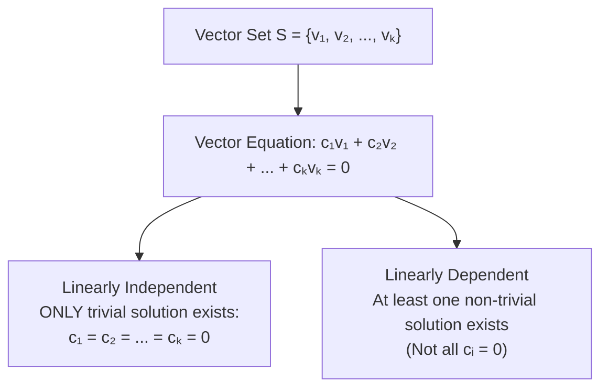

## Linear Combinations

Given a set of vectors $S = \{\mathbf{v}_1, \mathbf{v}_2, \dots, \mathbf{v}_k\}$ in a vector space $V$, a **linear combination** of $S$ is any vector $\mathbf{w}$ expressed as:

$$
\Huge
\mathbf{w} = c_1 \mathbf{v}_1 + c_2 \mathbf{v}_2 + \dots + c_k \mathbf{v}_k = \sum_{i=1}^{k} c_i \mathbf{v}_i
$$

Where:
- $\large c_1, c_2, \dots, c_k \in \mathbb{R}$ are scalars (weights / coefficients)

---

## Span of a Set of Vectors

The **Span** of a set of vectors $S = \{\mathbf{v}_1, \dots, \mathbf{v}_k\}$, denoted $\operatorname{Span}(S)$, is the collection of all possible linear combinations of the vectors in $S$:

$$
\Large
\operatorname{Span}(\mathbf{v}_1, \dots, \mathbf{v}_k) = \{c_1\mathbf{v}_1 + \dots + c_k\mathbf{v}_k \mid c_i \in \mathbb{R}\}
$$

$\operatorname{Span}(S)$ is always a subspace of $V$.

---

## Linear Independence vs. Linear Dependence



### Key Properties
- A set of two vectors is linearly dependent if and only if one is a scalar multiple of the other ($\mathbf{u} = k\mathbf{v}$).
- Any set containing the zero vector $\mathbf{0}$ is automatically **linearly dependent**.
- A set of $p$ vectors in $\mathbb{R}^n$ is linearly dependent if $p > n$.

---

## Testing for Linear Independence using Matrices

To determine if $\{\mathbf{v}_1, \mathbf{v}_2, \dots, \mathbf{v}_n\}$ are linearly independent in $\mathbb{R}^n$:

1. Construct matrix $A = \begin{bmatrix} \mathbf{v}_1 & \mathbf{v}_2 & \dots & \mathbf{v}_n \end{bmatrix}$.
2. Compute $\det(A)$ or find $\operatorname{RREF}(A)$:
   - If $\det(A) \ne 0 \iff$ Set is **Linearly Independent** (Every column has a pivot).
   - If $\det(A) = 0 \iff$ Set is **Linearly Dependent**.

---

## Basis and Dimension

A set of vectors $\mathcal{B} = \{\mathbf{v}_1, \dots, \mathbf{v}_n\}$ is a **basis** for vector space $V$ if:
1. $\mathcal{B}$ is **Linearly Independent**.
2. $\operatorname{Span}(\mathcal{B}) = V$.

The **Dimension** ($\dim(V)$) is the number of vectors in any basis of $V$.

---

## MATLAB Example

```matlab
% Vectors as columns of A
v1 = [1; 2; 3];
v2 = [2; 5; 7];
v3 = [3; 7; 10];

A = [v1 v2 v3];

% Check determinant
d = det(A);
disp(['Determinant: ', num2str(d)]);

if d ~= 0
    disp('Vectors are Linearly Independent');
else
    disp('Vectors are Linearly Dependent');
end
```
