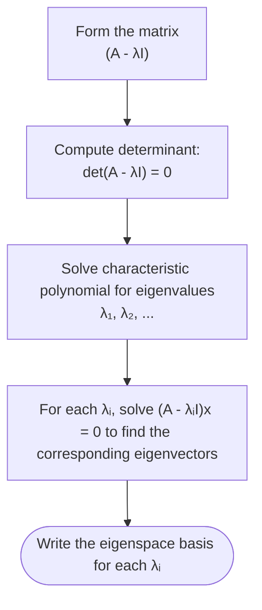

## Definition of Eigenvalues and Eigenvectors

Let $A$ be an $n \times n$ square matrix. A non-zero vector $\mathbf{x} \in \mathbb{R}^n$ ($\mathbf{x} \ne \mathbf{0}$) is an **eigenvector** of $A$ if there exists a scalar $\lambda$ such that:

$$
\Huge
A\mathbf{x} = \lambda \mathbf{x}
$$

Where:
- $\large A$ is the $n \times n$ **Transformation Matrix**
- $\large \mathbf{x} \ne \mathbf{0}$ is the **Eigenvector**
- $\large \lambda \in \mathbb{R}$ is the **Eigenvalue** associated with $\mathbf{x}$

---

## The Characteristic Equation

To find the eigenvalues $\lambda$, rewrite $A\mathbf{x} = \lambda \mathbf{x}$ as:

$$
\Large
(A - \lambda I)\mathbf{x} = \mathbf{0}
$$

For non-trivial solutions ($\mathbf{x} \ne \mathbf{0}$) to exist, the matrix $(A - \lambda I)$ must be non-invertible:

$$
\Huge
\det(A - \lambda I) = 0
$$

This determinant expansion yields the **characteristic polynomial** of degree $n$.

---

## Step-by-Step Procedure



---

## Worked Example

Find the eigenvalues and eigenvectors of $A = \begin{bmatrix} 4 & 2 \\ 3 & 3 \end{bmatrix}$:

### 1. Find Eigenvalues
$$
\begin{align*}
\det(A - \lambda I) &= \begin{vmatrix} 4 - \lambda & 2 \\ 3 & 3 - \lambda \end{vmatrix} = 0\\[6pt]
(4 - \lambda)(3 - \lambda) - (2)(3) &= 0\\
\lambda^2 - 7\lambda + 12 - 6 &= 0\\
\lambda^2 - 7\lambda + 6 &= 0\\
(\lambda - 6)(\lambda - 1) &= 0 \implies \lambda_1 = 6, \; \lambda_2 = 1
\end{align*}
$$

### 2. Find Eigenvector for $\lambda_1 = 6$
$$
(A - 6I)\mathbf{x} = \begin{bmatrix} -2 & 2 \\ 3 & -3 \end{bmatrix}\begin{bmatrix} x_1 \\ x_2 \end{bmatrix} = \begin{bmatrix} 0 \\ 0 \end{bmatrix}
\implies -2x_1 + 2x_2 = 0 \implies x_1 = x_2
$$
$$
\mathbf{x}_1 = t \begin{bmatrix} 1 \\ 1 \end{bmatrix} \quad (\text{Eigenvector: } [1, 1]^T)
$$

### 3. Find Eigenvector for $\lambda_2 = 1$
$$
(A - 1I)\mathbf{x} = \begin{bmatrix} 3 & 2 \\ 3 & 2 \end{bmatrix}\begin{bmatrix} x_1 \\ x_2 \end{bmatrix} = \begin{bmatrix} 0 \\ 0 \end{bmatrix}
\implies 3x_1 + 2x_2 = 0 \implies x_1 = -\frac{2}{3}x_2
$$
$$
\mathbf{x}_2 = t \begin{bmatrix} -2 \\ 3 \end{bmatrix} \quad (\text{Eigenvector: } [-2, 3]^T)
$$

---

## MATLAB Computation

```matlab
% Matrix definition
A = [4, 2; 3, 3];

% Compute eigenvalues (d) and eigenvectors (V as columns)
[V, D] = eig(A);

disp('Eigenvalues:');
disp(diag(D));

disp('Eigenvectors (columns of V):');
disp(V);
```
