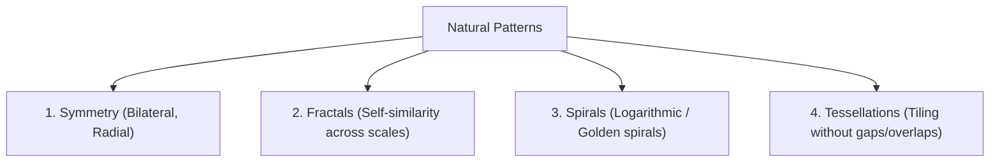

## Patterns in Nature

Patterns in nature are regularities of form, structure, or behavior found in the natural world:

---

## The Fibonacci Sequence

The **Fibonacci sequence** $\{F_n\}$ is a recursive sequence where each term is the sum of the two preceding terms:

$$
\Huge
F_n = F_{n-1} + F_{n-2} \quad (n \ge 3)
$$

With initial conditions:
$$
F_1 = 1, \quad F_2 = 1
$$

First terms of the sequence:
$$
1, 1, 2, 3, 5, 8, 13, 21, 34, 55, 89, 144, 233, 377, \dots
$$

---

## The Golden Ratio ($\Phi$)

As $n$ approaches infinity, the ratio of consecutive Fibonacci numbers converges to the **Golden Ratio** ($\Phi$):

$$
\Huge
\lim_{n \to \infty} \frac{F_n}{F_{n-1}} = \Phi = \frac{1 + \sqrt{5}}{2} \approx 1.6180339887\dots
$$

### Algebraic Relationship
$$
\Large
\Phi^2 = \Phi + 1 \implies \Phi^2 - \Phi - 1 = 0
$$

---

## Binet's Formula

An explicit closed-form expression for the $n$-th Fibonacci number:

$$
\Huge
F_n = \frac{1}{\sqrt{5}}\left[\left(\frac{1+\sqrt{5}}{2}\right)^n - \left(\frac{1-\sqrt{5}}{2}\right)^n\right] = \frac{\Phi^n - (-\Phi)^{-n}}{\sqrt{5}}
$$

$$
\textit{eg. Calculating } F_6:\\
\large
\begin{align*}
F_6 &= \frac{1.618034^6 - (-0.618034)^6}{\sqrt{5}}\\
&= \frac{17.94427 - 0.05573}{2.23607}\\
&= \frac{17.88854}{2.23607} = 8
\end{align*}
$$
