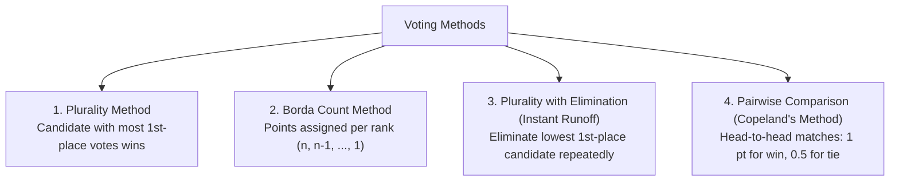
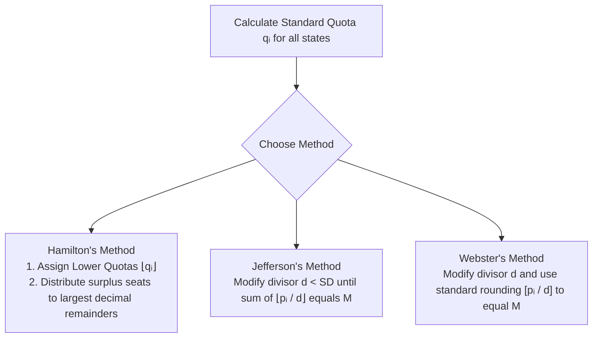

## Voting Methods (Social Choice Theory)

A **preference ballot** ranks candidates in order of preference ($1\text{st}, 2\text{nd}, 3\text{rd}, \dots$).

---

## Arrow's Impossibility Theorem & Fairness Criteria

Nobel laureate **Kenneth Arrow** proved that no ranked voting system with $3$ or more candidates can simultaneously satisfy all fairness criteria:

1. **Majority Criterion**: If a candidate receives a majority ($>50\%$) of 1st-place votes, they should win.
2. **Condorcet Criterion**: If a candidate beats every other candidate in pairwise head-to-head matchups, they should win.
3. **Monotonicity Criterion**: If voters increase preference for a winning candidate without changing others, that candidate should still win.
4. **Independence of Irrelevant Alternatives (IIA)**: If a non-winning candidate drops out, the winner should remain unchanged.

---

## Apportionment Methods

Apportionment is the problem of dividing a fixed number of discrete seats ($M$) among states proportionally based on population ($P$).

### Standard Divisor ($SD$)
$$
\Huge
SD = \frac{\text{Total Population } P}{\text{Total Number of Seats } M}
$$

### Standard Quota ($q_i$)
$$
\Huge
q_i = \frac{\text{State Population } p_i}{SD}
$$

- **Lower Quota**: $\lfloor q_i \rfloor$ (Rounded down)
- **Upper Quota**: $\lceil q_i \rceil$ (Rounded up)

---

## Apportionment Algorithms

