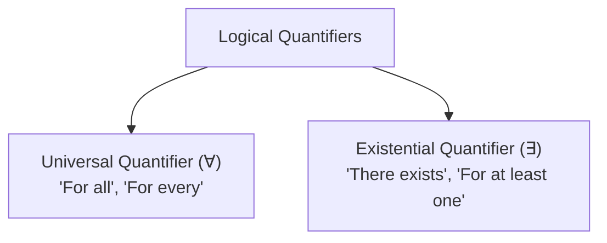

## Characteristics of Mathematical Language

Mathematical language is designed to be:
1. **Precise**: Able to make very fine distinctions without ambiguity.
2. **Concise**: Able to say things briefly.
3. **Powerful**: Able to express complex thoughts with relative ease.

---

## Set Theory Foundations

A **set** is a well-defined collection of distinct objects (elements).

### Set Notations and Operations

| Operation | Notation | Definition | Venn Diagram Concept |
| :--- | :--- | :--- | :--- |
| **Union** | $A \cup B$ | $\{x \mid x \in A \lor x \in B\}$ | Everything in either $A$ or $B$ |
| **Intersection** | $A \cap B$ | $\{x \mid x \in A \land x \in B\}$ | Overlap common to both $A$ and $B$ |
| **Difference** | $A \setminus B$ | $\{x \mid x \in A \land x \notin B\}$ | Elements in $A$ but not in $B$ |
| **Complement** | $A'$ or $A^c$ | $\{x \in U \mid x \notin A\}$ | Everything in universe $U$ outside $A$ |
| **Subset** | $A \subseteq B$ | $\forall x, (x \in A \implies x \in B)$ | $A$ is entirely contained within $B$ |

---

## Symbolic Logic and Propositions

A **proposition** is a declarative statement that is either strictly **True** ($T$) or strictly **False** ($F$), but not both.

### Logical Connectives and Truth Table

| $p$ | $q$ | Negation $\neg p$ | Conjunction $p \land q$ | Disjunction $p \lor q$ | Conditional $p \implies q$ | Biconditional $p \iff q$ |
| :---: | :---: | :---: | :---: | :---: | :---: | :---: |
| **T** | **T** | F | **T** | **T** | **T** | **T** |
| **T** | **F** | F | **F** | **T** | **F** | **F** |
| **F** | **T** | T | **F** | **T** | **T** | **F** |
| **F** | **F** | T | **F** | **F** | **T** | **T** |

---

## Quantifiers in Mathematics

### Negation of Quantified Statements
- $\neg(\forall x, P(x)) \equiv \exists x, \neg P(x)$
- $\neg(\exists x, P(x)) \equiv \forall x, \neg P(x)$
