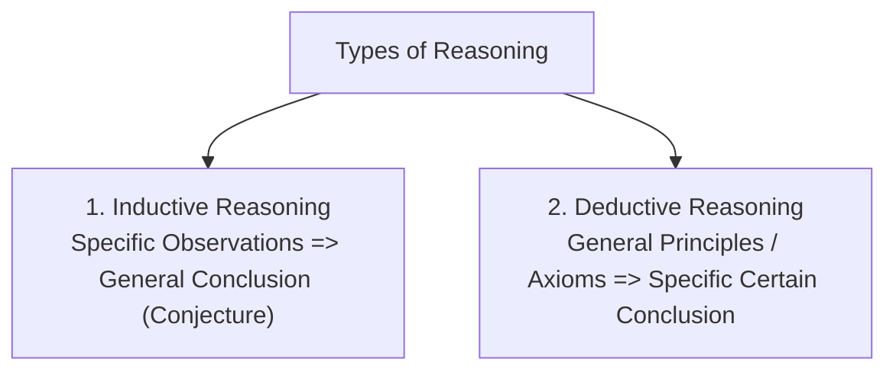
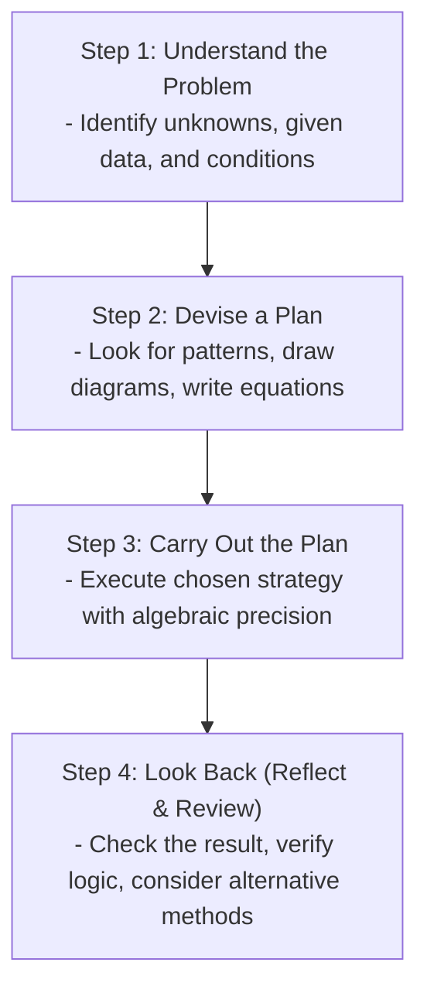

## Types of Mathematical Reasoning

### Inductive vs. Deductive Comparison

| Feature | Inductive Reasoning | Deductive Reasoning |
| :--- | :--- | :--- |
| **Flow** | Bottom-up (Specific $\to$ General) | Top-down (General $\to$ Specific) |
| **Certainty** | Probable / Plausible (Can be disproven by a single counterexample) | Logically Certain (If premises are true) |
| **Primary Use** | Forming hypotheses and conjectures | Rigorous mathematical proofs |

---

## Polya's 4-Step Problem-Solving Process

Developed by mathematician **George Pólya** in 1945:

---

## Common Problem-Solving Strategies

1. **Draw a Diagram / Picture**
2. **Look for a Pattern**
3. **Make a Systematic List or Table**
4. **Work Backwards**
5. **Solve a Simpler / Smaller Equivalent Problem**
6. **Guess and Check (Trial and Error with systematic refinement)**
7. **Set Up an Equation / Model**
