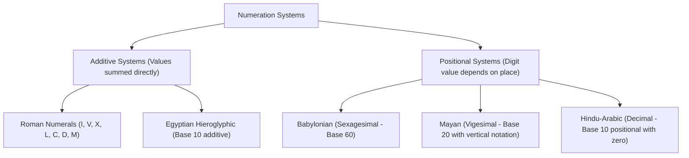

## Historical Numeration Systems

---

## Roman Numerals Reference

| Symbol | I | V | X | L | C | D | M |
| :---: | :---: | :---: | :---: | :---: | :---: | :---: | :---: |
| **Value** | 1 | 5 | 10 | 50 | 100 | 500 | 1,000 |

### Subtractive Notation Rules
- $\text{IV} = 4, \quad \text{IX} = 9$
- $\text{XL} = 40, \quad \text{XC} = 90$
- $\text{CD} = 400, \quad \text{CM} = 900$

$$
\textit{eg. Converting } \text{MCMXCIV} \text{ to Decimal:}\\
\large
1000 + (1000 - 100) + (100 - 10) + (5 - 1) = 1000 + 900 + 90 + 4 = 1994
$$

---

## Positional Base-$b$ Number Systems

Any number in base $b$ can be expanded into its polynomial positional form:

$$
\Huge
(d_n d_{n-1} \dots d_1 d_0)_b = \sum_{i=0}^{n} d_i \cdot b^i
$$

$$
\textit{eg. Base 8 (Octal) to Base 10 (Decimal):}\\
\large
\begin{align*}
357_8 &= (3 \cdot 8^2) + (5 \cdot 8^1) + (7 \cdot 8^0)\\
&= (3 \cdot 64) + (5 \cdot 8) + (7 \cdot 1)\\
&= 192 + 40 + 7\\
&= 239_{10}
\end{align*}
$$
