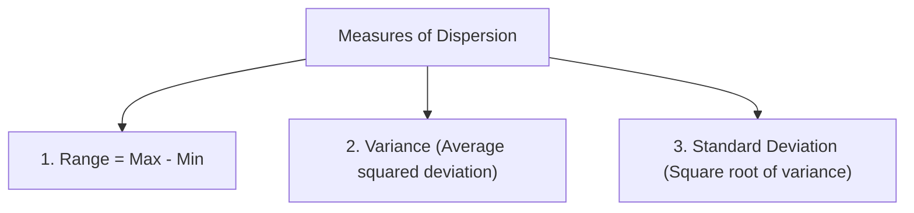

## Measures of Central Tendency

### 1. Mean ($\bar{x}$ or $\mu$)
The arithmetic average of a dataset:

$$
\Huge
\bar{x} = \frac{\sum_{i=1}^{n} x_i}{n}
$$

For grouped data with class midpoints $x_i$ and frequencies $f_i$:
$$
\Large
\bar{x} = \frac{\sum f_i x_i}{\sum f_i}
$$

### 2. Median ($\tilde{x}$)
The physical middle value of an ordered dataset.
- For odd $n$: Element at position $\frac{n+1}{2}$.
- For even $n$: Average of elements at positions $\frac{n}{2}$ and $\frac{n}{2} + 1$.

### 3. Mode ($\hat{x}$)
The value(s) that appear with the highest frequency in the dataset.

---

## Measures of Dispersion (Variability)

### Sample Variance ($s^2$)
$$
\Huge
s^2 = \frac{\sum_{i=1}^{n} (x_i - \bar{x})^2}{n - 1} = \frac{\sum x_i^2 - \dfrac{(\sum x_i)^2}{n}}{n - 1}
$$

### Sample Standard Deviation ($s$)
$$
\Huge
s = \sqrt{s^2} = \sqrt{\frac{\sum_{i=1}^{n} (x_i - \bar{x})^2}{n - 1}}
$$

### Population Standard Deviation ($\sigma$)
$$
\Large
\sigma = \sqrt{\frac{\sum_{i=1}^{N} (x_i - \mu)^2}{N}}
$$

---

## Worked Example: Ungrouped Data

Given dataset: $4, 8, 6, 5, 3, 7$ ($n = 6$)

$$
\large
\begin{align*}
\sum x &= 4 + 8 + 6 + 5 + 3 + 7 = 33\\[4pt]
\bar{x} &= \frac{33}{6} = 5.5\\[6pt]
\sum x^2 &= 16 + 64 + 36 + 25 + 9 + 49 = 199\\[6pt]
s^2 &= \frac{199 - \frac{33^2}{6}}{6 - 1} = \frac{199 - 181.5}{5} = \frac{17.5}{5} = 3.5\\[6pt]
s &= \sqrt{3.5} \approx 1.87
\end{align*}
$$
