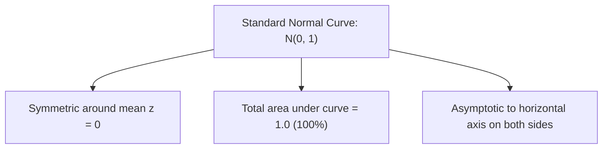

## The Normal Distribution

The **Normal (Gaussian) Distribution** is a continuous, bell-shaped, symmetric probability distribution centered at mean $\mu$ with dispersion determined by standard deviation $\sigma$.

---

## The Empirical Rule (68–95–99.7 Rule)

For any normally distributed dataset:

$$
\Large
\begin{cases}
\approx 68.26\% \text{ of data falls within } \mu \pm 1\sigma\\
\approx 95.44\% \text{ of data falls within } \mu \pm 2\sigma\\
\approx 99.74\% \text{ of data falls within } \mu \pm 3\sigma
\end{cases}
$$

---

## Standard Normal Score ($z$-Score)

The $z$-score standardizes any raw score $x$ by transforming it into the number of standard deviations it lies from the mean:

$$
\Huge
z = \frac{x - \mu}{\sigma} \quad \text{or} \quad z = \frac{x - \bar{x}}{s}
$$

Where:
- $\large x$ is the **Raw Score**
- $\large \mu$ is the **Population Mean**
- $\large \sigma$ is the **Population Standard Deviation**
- $\large z$ is the **Standard Normal Variable** ($Z \sim \mathcal{N}(0, 1)$)

---

## Computing Normal Probabilities

$$
\textit{eg. Finding } P(x > 85) \text{ when } \mu = 70, \; \sigma = 10:\\
\large
\begin{align*}
z &= \frac{85 - 70}{10} = \frac{15}{10} = 1.50\\[6pt]
P(X > 85) &= P(Z > 1.50) = 1 - P(Z \le 1.50)\\
&= 1 - 0.9332 = 0.0668 \quad (6.68\%)
\end{align*}
$$
