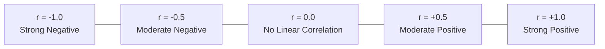

## Pearson's Correlation Coefficient ($r$)

The **Pearson Product-Moment Correlation Coefficient** ($r$) measures the strength and direction of a linear relationship between two quantitative variables:

$$
\Huge
r = \frac{n \sum xy - (\sum x)(\sum y)}{\sqrt{\left[n \sum x^2 - (\sum x)^2\right] \left[n \sum y^2 - (\sum y)^2\right]}}
$$

Where:
- $\large -1 \le r \le 1$
- $\large r = +1$: Perfect positive linear correlation
- $\large r = -1$: Perfect negative linear correlation
- $\large r = 0$: No linear relationship

---

## Simple Linear Regression Equation

The regression line (line of best fit) predicts the value of dependent variable $y$ from independent variable $x$:

$$
\Huge
\hat{y} = a + bx
$$

Where:

### Slope ($b$)
$$
\Large
b = \frac{n \sum xy - (\sum x)(\sum y)}{n \sum x^2 - (\sum x)^2}
$$

### $y$-Intercept ($a$)
$$
\Large
a = \bar{y} - b\bar{x} = \frac{\sum y - b\sum x}{n}
$$

---

## Coefficient of Determination ($r^2$)

The proportion of the total variation in $y$ that is explained by the linear relationship with $x$:

$$
\Large
r^2 = (r)^2 \quad (0 \le r^2 \le 1)
$$
