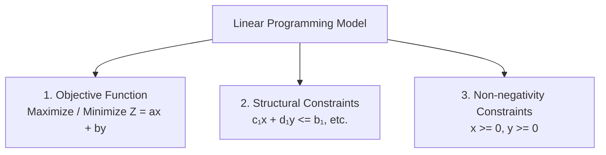
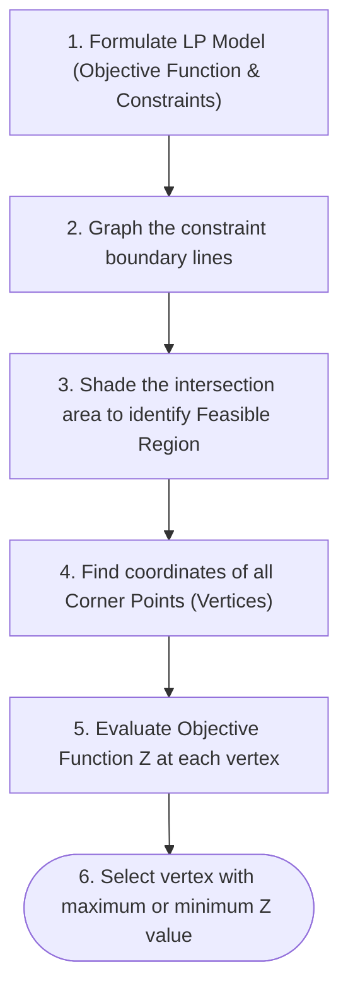

## Linear Programming Overview

**Linear Programming (LP)** is an optimization technique used to maximize or minimize a linear objective function subject to a set of linear inequality constraints.

---

## Fundamental Components

### 1. Objective Function
$$
\Huge
\text{Maximize / Minimize } Z = c_1 x_1 + c_2 x_2
$$

### 2. Constraints (System of Inequalities)
$$
\Large
\begin{cases}
a_{11} x_1 + a_{12} x_2 \le b_1\\
a_{21} x_1 + a_{22} x_2 \le b_2\\
x_1 \ge 0, \; x_2 \ge 0
\end{cases}
$$

---

## The Corner Point Theorem (Fundamental Theorem of LP)

If a linear programming problem has an optimal solution, it must occur at one or more of the **corner points (vertices)** of the **feasible region**.

---

## Worked Example

Maximize:
$$
Z = 5x + 4y
$$
Subject to:
$$
\begin{cases}
x + y \le 6\\
2x + y \le 8\\
x \ge 0, \; y \ge 0
\end{cases}
$$

### 1. Identify Vertices of Feasible Region
- $A(0, 0)$
- $B(4, 0)$ (from $2x + y = 8$ at $y = 0$)
- $C(2, 4)$ (intersection of $x + y = 6$ and $2x + y = 8$)
- $D(0, 6)$ (from $x + y = 6$ at $x = 0$)

### 2. Evaluate Objective Function $Z$

| Corner Point $(x, y)$ | $Z = 5x + 4y$ | Value |
| :--- | :--- | :--- |
| $(0, 0)$ | $5(0) + 4(0)$ | $0$ |
| $(4, 0)$ | $5(4) + 4(0)$ | $20$ |
| **$(2, 4)$** | $5(2) + 4(4) = 10 + 16$ | **$26$ (Maximum)** |
| $(0, 6)$ | $5(0) + 4(6)$ | $24$ |

**Optimal Solution**: Maximum $Z = 26$ occurs at $x = 2, y = 4$.
