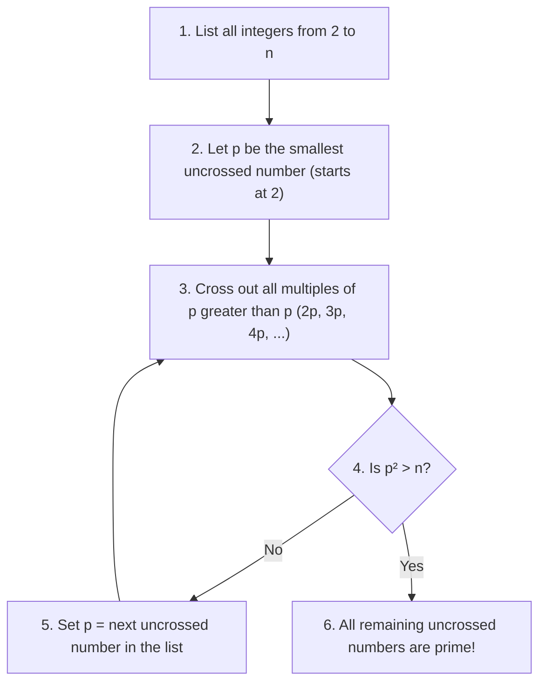

## Prime and Composite Numbers

An integer $p > 1$ is called a **prime number** if its only positive divisors are $1$ and $p$. An integer greater than $1$ that is not prime is called **composite**.

- The integer $1$ is neither prime nor composite.
- $2$ is the smallest and only even prime number.

---

## The Fundamental Theorem of Arithmetic (FTA)

Every integer $n > 1$ can be represented uniquely as a product of prime numbers (up to the order of the factors):

$$
\Huge
n = p_1^{k_1} \cdot p_2^{k_2} \cdot \dots \cdot p_r^{k_r} = \prod_{i=1}^{r} p_i^{k_i}
$$

Where:
- $\large p_1 < p_2 < \dots < p_r$ are distinct prime numbers
- $\large k_i \ge 1$ are positive integers (multiplicities)

$$
\textit{eg.}\\
\large
\begin{align*}
360 &= 2^3 \cdot 3^2 \cdot 5^1\\
4725 &= 3^3 \cdot 5^2 \cdot 7^1
\end{align*}
$$

---

## GCD and LCM using Prime Factorization

Let $a = \prod p_i^{\alpha_i}$ and $b = \prod p_i^{\beta_i}$:

$$
\Large
\gcd(a, b) = \prod_{i=1}^{r} p_i^{\min(\alpha_i, \beta_i)}
$$

$$
\Large
\operatorname{lcm}(a, b) = \prod_{i=1}^{r} p_i^{\max(\alpha_i, \beta_i)}
$$

$$
\textit{eg.}\\
\large
\begin{align*}
a &= 360 = 2^3 \cdot 3^2 \cdot 5^1 \cdot 7^0\\
b &= 4725 = 2^0 \cdot 3^3 \cdot 5^2 \cdot 7^1\\[6pt]
\gcd(a, b) &= 2^{\min(3,0)} \cdot 3^{\min(2,3)} \cdot 5^{\min(1,2)} \cdot 7^{\min(0,1)}\\
&= 2^0 \cdot 3^2 \cdot 5^1 \cdot 7^0 = 9 \cdot 5 = 45\\[6pt]
\operatorname{lcm}(a, b) &= 2^{\max(3,0)} \cdot 3^{\max(2,3)} \cdot 5^{\max(1,2)} \cdot 7^{\max(0,1)}\\
&= 2^3 \cdot 3^3 \cdot 5^2 \cdot 7^1 = 8 \cdot 27 \cdot 25 \cdot 7 = 37,800
\end{align*}
$$

---

## Sieve of Eratosthenes

The Sieve of Eratosthenes is an algorithm for finding all prime numbers up to a specified integer $n$:

---

## Special Prime Forms

### Twin Primes
Pairs of primes that differ by $2$: $(p, p+2)$.
- Examples: $(3, 5), (5, 7), (11, 13), (17, 19), (29, 31), (41, 43)$.
- Every twin prime pair except $(3, 5)$ is of the form $(6n-1, 6n+1)$ for some $n \in \mathbb{N}$.

### Mersenne Primes
Primes of the form:
$$
\Large
M_p = 2^p - 1 \quad \text{where } p \text{ is prime}
$$

### Fermat Primes
Primes of the form:
$$
\Large
F_n = 2^{2^n} + 1 \quad \text{where } n \ge 0
$$
