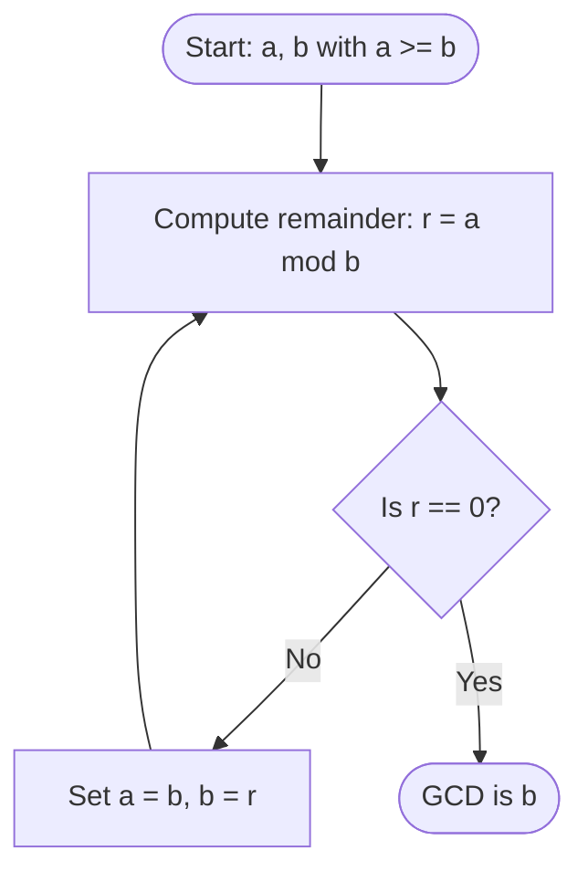

## Greatest Common Divisor (GCD)

The Greatest Common Divisor of two non-zero integers $a$ and $b$, denoted by $\gcd(a, b)$, is the largest positive integer $d$ that divides both $a$ and $b$:

$$
\Large
d = \gcd(a, b) \iff (d \mid a) \land (d \mid b) \land (\forall c \in \mathbb{Z}, (c \mid a \land c \mid b) \implies c \le d)
$$

### Properties of GCD

- $\gcd(a, b) = \gcd(b, a)$
- $\gcd(a, b) = \gcd(|a|, |b|)$
- $\gcd(a, 0) = |a|$ for $a \ne 0$
- If $\gcd(a, b) = 1$, then $a$ and $b$ are **relatively prime** (coprime).

---

## Least Common Multiple (LCM)

The Least Common Multiple of two integers $a$ and $b$, denoted by $\operatorname{lcm}(a, b)$, is the smallest positive integer $m$ that is a multiple of both $a$ and $b$.

### Relationship between GCD and LCM

$$
\Huge
\gcd(a, b) \cdot \operatorname{lcm}(a, b) = |a \cdot b|
$$

$$
\textit{eg.}\\
\large
\begin{align*}
a = 12, \; b = 18 &\implies \gcd(12, 18) = 6\\
&\implies \operatorname{lcm}(12, 18) = \frac{12 \cdot 18}{6} = 36
\end{align*}
$$

---

## The Euclidean Algorithm

The Euclidean Algorithm computes $\gcd(a, b)$ efficiently using repeated division with remainders:

$$
\Large
\gcd(a, b) = \gcd(b, r) \quad \text{where } a = bq + r
$$

### Step-by-Step Example

Find $\gcd(252, 105)$:

$$
\large
\begin{align*}
252 &= 105 \cdot 2 + 42\\
105 &= 42 \cdot 2 + 21\\
42 &= 21 \cdot 2 + 0 \quad (\text{Remainder is } 0)\\
\implies \gcd(252, 105) &= 21
\end{align*}
$$

---

## Bézout's Identity and Linear Combinations

For any non-zero integers $a$ and $b$, there exist integers $x$ and $y$ such that:

$$
\Huge
\gcd(a, b) = ax + by
$$

### Extended Euclidean Algorithm (Back-Substitution)

Using the divisions from $\gcd(252, 105) = 21$:

$$
\large
\begin{align*}
21 &= 105 - 42 \cdot 2\\
42 &= 252 - 105 \cdot 2\\
\implies 21 &= 105 - (252 - 105 \cdot 2) \cdot 2\\
&= 105 - 252(2) + 105(4)\\
&= 252(-2) + 105(5)\\
\therefore x &= -2, \quad y = 5
\end{align*}
$$
