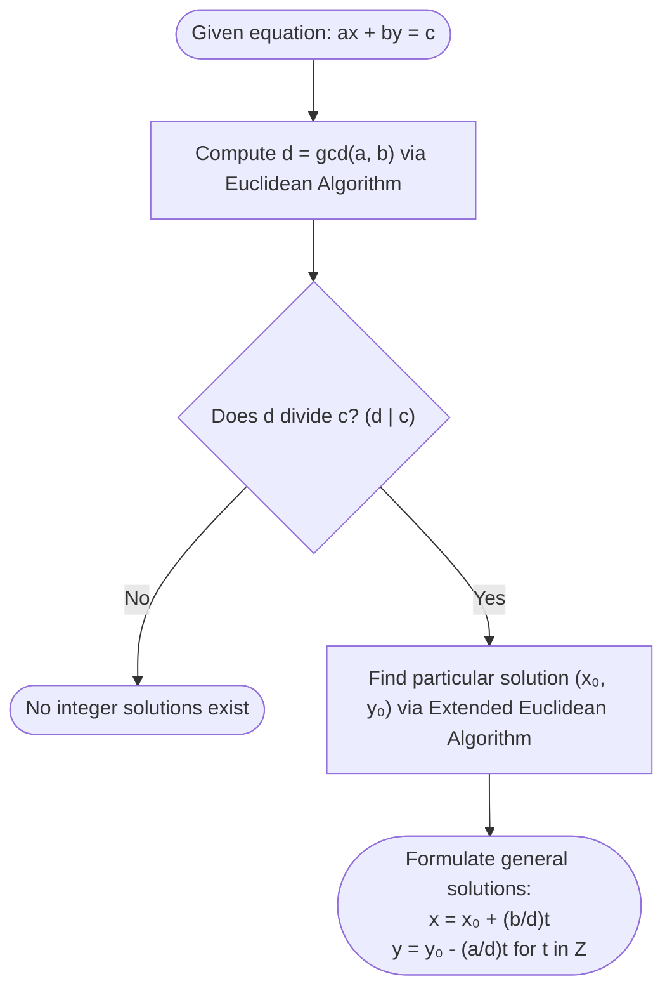

## Linear Diophantine Equation

A **Linear Diophantine Equation** in two variables is an algebraic equation of the form:

$$
\Huge
ax + by = c
$$

Where:
- $\large a, b, c \in \mathbb{Z}$ are given constants ($a, b$ not both zero)
- $\large x, y \in \mathbb{Z}$ are integer unknowns to be solved

---

## Solvability Criterion (Existence of Solutions)

A linear Diophantine equation $ax + by = c$ has integer solutions if and only if $d$ divides $c$:

$$
\Large
d \mid c \quad \text{where } d = \gcd(a, b)
$$

If $d \nmid c$, there are **no integer solutions**.

---

## General Solution Formula

If $(x_0, y_0)$ is a particular integer solution to $ax + by = c$, then the complete set of integer solutions is given by:

$$
\Huge
\begin{cases}
x = x_0 + \left(\dfrac{b}{d}\right)t\\[10pt]
y = y_0 - \left(\dfrac{a}{d}\right)t
\end{cases}
\quad (t \in \mathbb{Z})
$$

Where:
- $\large d = \gcd(a, b)$
- $\large (x_0, y_0)$ is a particular solution
- $\large t \in \mathbb{Z}$ is an arbitrary integer parameter

---

## Step-by-Step Solution Algorithm

### Worked Example

Solve the equation:
$$
172x + 20y = 1000
$$

**1. Calculate $\gcd(172, 20)$:**
$$
\begin{align*}
172 &= 20(8) + 12\\
20 &= 12(1) + 8\\
12 &= 8(1) + 4\\
8 &= 4(2) + 0 \implies d = \gcd(172, 20) = 4
\end{align*}
$$

**2. Check Solvability:**
$$
4 \mid 1000 \implies \frac{1000}{4} = 250 \quad \text{(Solutions exist)}
$$

**3. Express $\gcd$ as a Linear Combination:**
$$
\begin{align*}
4 &= 12 - 8(1)\\
&= 12 - (20 - 12(1)) = 12(2) - 20(1)\\
&= (172 - 20(8))(2) - 20(1)\\
&= 172(2) - 20(17)\\
\implies 172(2) + 20(-17) &= 4
\end{align*}
$$

**4. Multiply by $250$ to match $c = 1000$:**
$$
\begin{align*}
172(2 \cdot 250) + 20(-17 \cdot 250) &= 1000\\
172(500) + 20(-4250) &= 1000\\
\implies x_0 &= 500, \quad y_0 = -4250
\end{align*}
$$

**5. Write General Solution:**
$$
\begin{cases}
x = 500 + \left(\dfrac{20}{4}\right)t = 500 + 5t\\[8pt]
y = -4250 - \left(\dfrac{172}{4}\right)t = -4250 - 43t
\end{cases}
\quad (t \in \mathbb{Z})
$$
