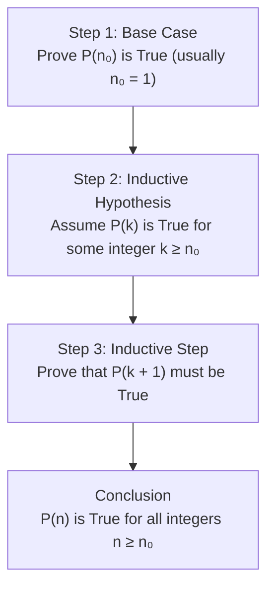

## Principle of Mathematical Induction

Mathematical Induction is a proof technique used to establish that a statement $P(n)$ is true for all natural numbers $n \ge n_0$.

---

## The Induction Steps

1. **Base Step**: Show that the proposition $P(n_0)$ is true for the initial value $n_0$ (usually $n = 1$).
2. **Induction Hypothesis**: Assume that $P(k)$ is true for an arbitrary integer $k \ge n_0$.
3. **Inductive Step**: Show that the truth of $P(k)$ implies the truth of $P(k+1)$:
   $$
   \Large
   P(k) \implies P(k+1)
   $$

---

## Example: Sum of First $n$ Positive Integers

Prove that for all $n \ge 1$:

$$
\Large
\sum_{i=1}^{n} i = 1 + 2 + 3 + \dots + n = \frac{n(n+1)}{2}
$$

### Proof

**1. Base Case ($n = 1$):**
$$
\begin{align*}
\text{LHS} &= 1\\
\text{RHS} &= \frac{1(1+1)}{2} = \frac{2}{2} = 1\\
\text{LHS} &= \text{RHS} \quad \text{(True)}
\end{align*}
$$

**2. Inductive Hypothesis:**
Assume the formula holds for $n = k$:
$$
1 + 2 + \dots + k = \frac{k(k+1)}{2}
$$

**3. Inductive Step ($n = k + 1$):**
We must prove that:
$$
1 + 2 + \dots + k + (k+1) = \frac{(k+1)((k+1)+1)}{2} = \frac{(k+1)(k+2)}{2}
$$

Starting with the LHS:
$$
\begin{align*}
(1 + 2 + \dots + k) + (k+1) &= \frac{k(k+1)}{2} + (k+1)\\
&= \frac{k(k+1) + 2(k+1)}{2}\\
&= \frac{(k+1)(k+2)}{2}
\end{align*}
$$

Since the LHS equals the RHS, $P(k+1)$ is true whenever $P(k)$ is true. By the Principle of Mathematical Induction, the formula holds for all integers $n \ge 1$.
