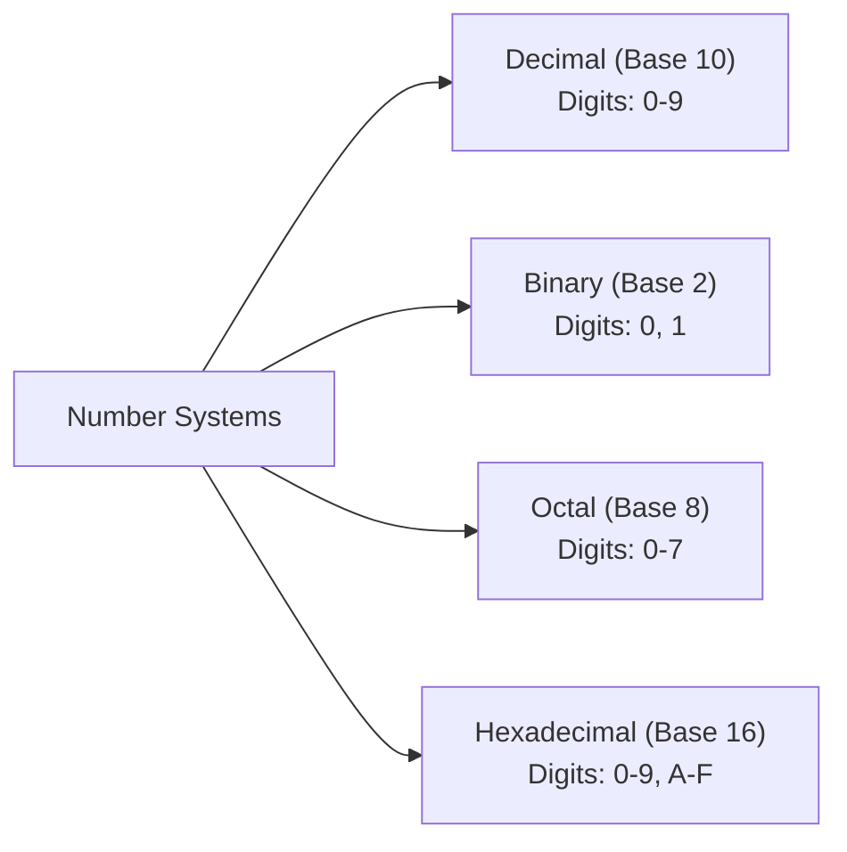
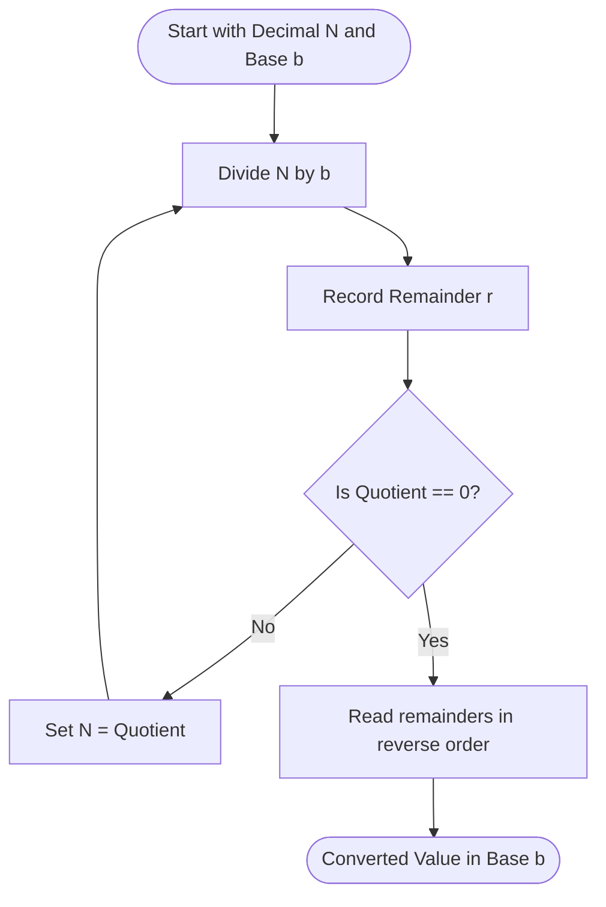

## Number Systems

A positional numeral system uses a base (radix) $b$ where a number is expressed as a sum of powers of the base:

$$
\Large
N = \sum_{i=0}^{n} d_i \cdot b^i = d_n b^n + d_{n-1} b^{n-1} + \dots + d_1 b^1 + d_0 b^0
$$

Where:
- $\large b$ is the **Base / Radix** ($b \ge 2$)
- $\large d_i$ are the **Digits** ($0 \le d_i < b$)
- $\large n$ is the **Position of the most significant digit**

---

## Common Radix Systems

| System | Base ($b$) | Digits | Notation Example |
| :--- | :--- | :--- | :--- |
| **Binary** | $2$ | $0, 1$ | $101101_2$ |
| **Octal** | $8$ | $0, 1, 2, 3, 4, 5, 6, 7$ | $55_8$ |
| **Decimal** | $10$ | $0, 1, 2, 3, 4, 5, 6, 7, 8, 9$ | $45_{10}$ |
| **Hexadecimal** | $16$ | $0-9, \text{A}(10), \text{B}(11), \text{C}(12), \text{D}(13), \text{E}(14), \text{F}(15)$ | $2\text{D}_{16}$ |

---

## Base Conversion Algorithms

### 1. Base-$b$ to Decimal (Expansion Method)

Multiply each digit by $b^i$ where $i$ is the position index from right to left starting at $0$.

$$
\textit{eg. Converting } 110101_2 \text{ to Base 10:}\\
\large
\begin{align*}
110101_2 &= (1 \cdot 2^5) + (1 \cdot 2^4) + (0 \cdot 2^3) + (1 \cdot 2^2) + (0 \cdot 2^1) + (1 \cdot 2^0)\\
&= 32 + 16 + 0 + 4 + 0 + 1\\
&= 53_{10}
\end{align*}
$$

### 2. Decimal to Base-$b$ (Successive Division Algorithm)

Continuously divide the integer by base $b$ and record the remainders until quotient is $0$. The result is read from bottom to top (most significant bit to least significant bit).

$$
\textit{eg. Converting } 125_{10} \text{ to Base 2:}\\
\large
\begin{align*}
125 \div 2 &= 62 \quad \text{Remainder: } 1 \; (\text{LSB})\\
62 \div 2 &= 31 \quad \text{Remainder: } 0\\
31 \div 2 &= 15 \quad \text{Remainder: } 1\\
15 \div 2 &= 7 \quad \text{Remainder: } 1\\
7 \div 2 &= 3 \quad \text{Remainder: } 1\\
3 \div 2 &= 1 \quad \text{Remainder: } 1\\
1 \div 2 &= 0 \quad \text{Remainder: } 1 \; (\text{MSB})\\
\implies 125_{10} &= 1111101_2
\end{align*}
$$
